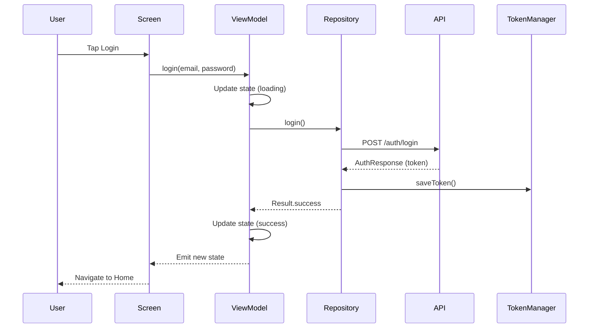
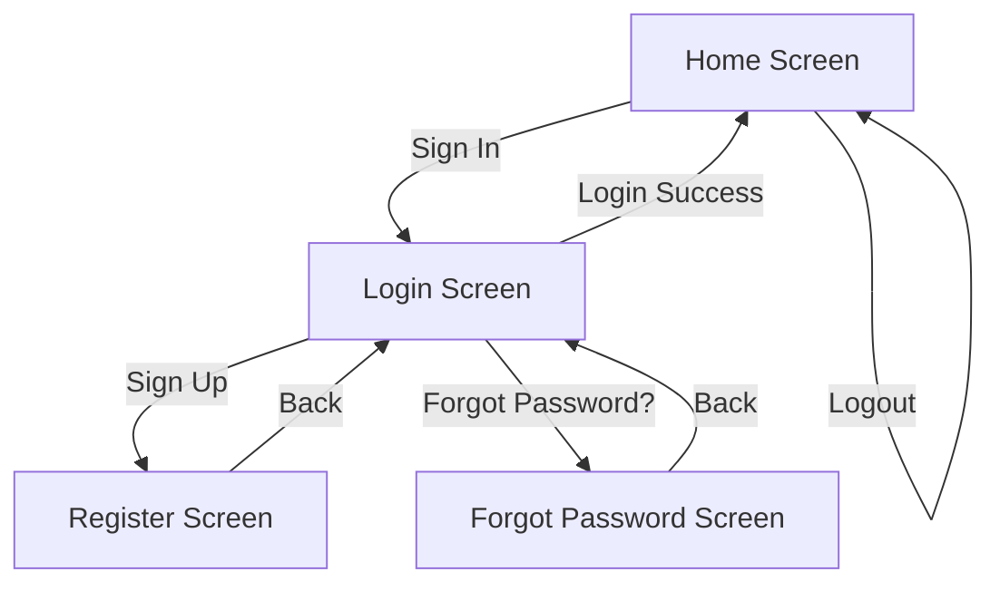
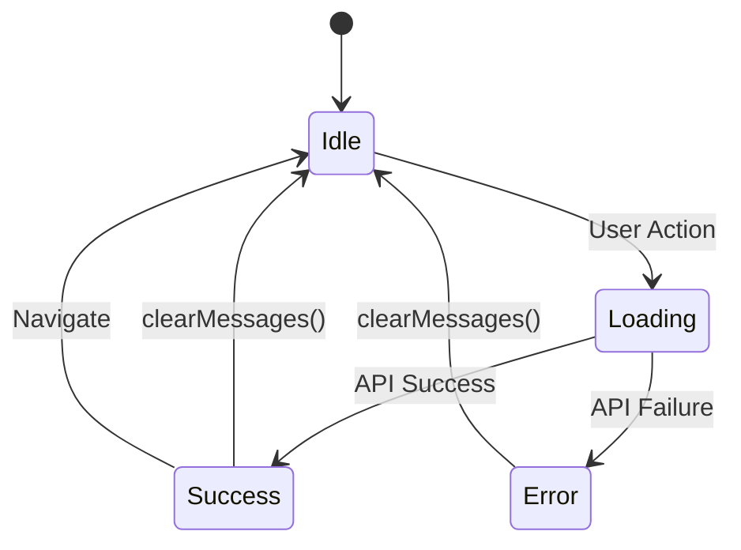

# 📱 STAR Financial Bootcamp - Comprehensive Documentation

This document provides a complete technical reference for the STAR Financial Bootcamp Android application, built with **Jetpack Compose** and following modern Android architecture patterns.

---

## Table of Contents

1. [Project Overview](#project-overview)
2. [Technology Stack](#technology-stack)
3. [Architecture](#architecture)
4. [Project Structure](#project-structure)
5. [Dependencies](#dependencies)
6. [Data Layer](#data-layer)
7. [UI Layer](#ui-layer)
8. [Navigation](#navigation)
9. [API Integration](#api-integration)
10. [State Management](#state-management)
11. [Local Storage](#local-storage)
12. [Screens](#screens)
13. [Getting Started](#getting-started)
14. [Testing Guide](#testing-guide)

---

## Project Overview

STAR Financial Bootcamp is a modern Android application that demonstrates best practices for building authentication flows with Jetpack Compose. The app provides:

- **User Registration** - Create new accounts with validation
- **User Login** - Authenticate with email/username and password
- **Password Recovery** - Request password reset via email
- **Session Management** - JWT-based authentication with persistent storage
- **Responsive UI** - Material 3 design with consistent theming

---

## Technology Stack

| Category | Technology | Version |
|----------|------------|---------|
| **Language** | Kotlin | 2.0.21 |
| **UI Framework** | Jetpack Compose | BOM 2024.09.00 |
| **Design System** | Material 3 | Latest |
| **Architecture** | MVVM + Repository Pattern | - |
| **Network** | Retrofit | 2.9.0 |
| **HTTP Client** | OkHttp | 4.12.0 |
| **Navigation** | Navigation Compose | 2.7.7 |
| **Local Storage** | DataStore Preferences | 1.0.0 |
| **State Management** | StateFlow + Compose State | - |
| **Build System** | Gradle (Kotlin DSL) | 8.13.2 |

---

## Architecture

The application follows **Clean Architecture** principles with clear separation of concerns:

```
┌─────────────────────────────────────────────────────────┐
│                     UI Layer                            │
│  ┌─────────────┐  ┌─────────────┐  ┌─────────────┐     │
│  │  Screens    │  │  ViewModel  │  │  Navigation │     │
│  │ (Composable)│  │ (StateFlow) │  │  (NavHost)  │     │
│  └─────────────┘  └─────────────┘  └─────────────┘     │
└───────────────────────────┬─────────────────────────────┘
                            │
                            ▼
┌─────────────────────────────────────────────────────────┐
│                   Data Layer                            │
│  ┌─────────────────────────────────────────────────┐   │
│  │              Repository                          │   │
│  │  (Single Source of Truth for Auth Data)         │   │
│  └─────────────────────────────────────────────────┘   │
│           │                           │                 │
│           ▼                           ▼                 │
│  ┌─────────────────┐      ┌─────────────────┐          │
│  │   Remote Data   │      │   Local Data    │          │
│  │  (AuthService)  │      │ (TokenManager)  │          │
│  └─────────────────┘      └─────────────────┘          │
└─────────────────────────────────────────────────────────┘
```

### Data Flow



---

## Project Structure

```
app/src/main/java/com/example/bootcamp/
├── MainActivity.kt              # App entry point
├── data/
│   ├── api/
│   │   ├── AuthService.kt       # Retrofit API interface
│   │   └── RetrofitClient.kt    # Retrofit configuration
│   ├── local/
│   │   └── TokenManager.kt      # DataStore token persistence
│   ├── model/
│   │   └── AuthModels.kt        # Request/Response DTOs
│   └── repository/
│       └── AuthRepository.kt    # Data source abstraction
└── ui/
    ├── navigation/
    │   └── Navigation.kt        # NavHost & Routes
    ├── screens/
    │   ├── ForgotPasswordScreen.kt
    │   ├── HomeScreen.kt
    │   ├── LoginScreen.kt
    │   └── RegisterScreen.kt
    ├── theme/
    │   ├── Color.kt             # Color palette
    │   ├── Theme.kt             # Material 3 theme
    │   └── Type.kt              # Typography
    └── viewmodel/
        └── AuthViewModel.kt     # UI state management
```

### Directory Purposes

| Directory | Purpose |
|-----------|---------|
| `data/api/` | Network layer - Retrofit services and client |
| `data/local/` | Local persistence - DataStore management |
| `data/model/` | Data Transfer Objects (DTOs) |
| `data/repository/` | Data abstraction - coordinates remote & local |
| `ui/navigation/` | App navigation graph and routes |
| `ui/screens/` | Composable screen implementations |
| `ui/theme/` | Design system tokens |
| `ui/viewmodel/` | Presentation logic and state |

---

---

## Security

### CSRF Protection
The application implements robust **Cross-Site Request Forgery (CSRF)** protection using the Sync Token Pattern.

#### Mechanism
1.  **Dual Tokens**:
    *   `accessToken` (HttpOnly Cookie): Validates identity (JWT).
    *   `XSRF-TOKEN` (Standard Cookie): Validates request origin.
2.  **Persistence**:
    *   Cookies are captured by `PersistentCookieJar`.
    *   `XSRF-TOKEN` is persisted to `DataStore` to survive app restarts.
3.  **Automatic Injection**:
    *   `CsrfInterceptor` automatically attaches the `X-XSRF-TOKEN` header to all state-changing requests (`POST`, `PUT`, `DELETE`).

#### Key Components
*   **PersistentCookieJar**: Handles cookie storage/retrieval.
*   **CsrfInterceptor**: Adds the security header.
*   **TokenManager**: securely stores the tokens.

---

## Dependencies

### Gradle Version Catalog (`libs.versions.toml`)

```toml
[versions]
agp = "8.13.2"
kotlin = "2.0.21"
composeBom = "2024.09.00"
retrofit = "2.9.0"
okhttp = "4.12.0"
navigationCompose = "2.7.7"
datastore = "1.0.0"

[libraries]
# Compose
androidx-compose-bom = { group = "androidx.compose", name = "compose-bom", version.ref = "composeBom" }
androidx-compose-material3 = { group = "androidx.compose.material3", name = "material3" }
material-icons-extended = { group = "androidx.compose.material", name = "material-icons-extended" }

# Network
retrofit = { group = "com.squareup.retrofit2", name = "retrofit", version.ref = "retrofit" }
retrofit-converter-gson = { group = "com.squareup.retrofit2", name = "converter-gson", version.ref = "retrofit" }
okhttp = { group = "com.squareup.okhttp3", name = "okhttp", version.ref = "okhttp" }
okhttp-logging = { group = "com.squareup.okhttp3", name = "logging-interceptor", version.ref = "okhttp" }

# Navigation
navigation-compose = { group = "androidx.navigation", name = "navigation-compose", version.ref = "navigationCompose" }

# Storage
datastore-preferences = { group = "androidx.datastore", name = "datastore-preferences", version.ref = "datastore" }
```

---

## Data Layer

### AuthModels.kt - Data Transfer Objects

```kotlin
// Request DTOs
data class RegisterRequest(
    val username: String,
    val email: String,
    val password: String,
)

data class LoginRequest(
    val usernameOrEmail: String,
    val password: String,
)

data class ForgotPasswordRequest(
    val email: String,
)

data class ResetPasswordRequest(
    val token: String,
    val newPassword: String,
)

// Response DTOs
data class AuthResponse(
    val token: String? = null,
    val message: String? = null,
    val success: Boolean = false,
)

data class ApiResponse(
    val success: Boolean = false,
    val message: String? = null,
)
```

### AuthService.kt - Retrofit Interface

```kotlin
interface AuthService {
    @POST("auth/register")
    suspend fun register(@Body request: RegisterRequest): Response<AuthResponse>

    @POST("auth/login")
    suspend fun login(@Body request: LoginRequest): Response<AuthResponse>

    @POST("auth/forgot-password")
    suspend fun forgotPassword(@Body request: ForgotPasswordRequest): Response<ApiResponse>

    @POST("auth/reset-password")
    suspend fun resetPassword(@Body request: ResetPasswordRequest): Response<ApiResponse>

    @POST("auth/logout")
    suspend fun logout(@Header("Authorization") token: String): Response<ApiResponse>
}
```

### RetrofitClient.kt - Network Configuration

```kotlin
object RetrofitClient {
    private const val BASE_URL = "http://10.0.2.2:8081/"  // Emulator localhost

    private val loggingInterceptor = HttpLoggingInterceptor().apply {
        level = HttpLoggingInterceptor.Level.BODY
    }

    private val okHttpClient = OkHttpClient.Builder()
        .addInterceptor(loggingInterceptor)
        .connectTimeout(30, TimeUnit.SECONDS)
        .readTimeout(30, TimeUnit.SECONDS)
        .writeTimeout(30, TimeUnit.SECONDS)
        .build()

    private val retrofit: Retrofit = Retrofit.Builder()
        .baseUrl(BASE_URL)
        .client(okHttpClient)
        .addConverterFactory(GsonConverterFactory.create())
        .build()

    val authService: AuthService = retrofit.create(AuthService::class.java)
}
```

> [!NOTE]
> **Emulator URL**: `10.0.2.2` maps to `localhost` on the host machine when running on Android Emulator. For physical device testing, replace with your machine's IP address.

### AuthRepository.kt - Data Abstraction

The repository coordinates between remote API and local storage:

```kotlin
class AuthRepository(private val tokenManager: TokenManager) {

    private val authService = RetrofitClient.authService

    suspend fun login(usernameOrEmail: String, password: String): Result<String> {
        return try {
            val response = authService.login(LoginRequest(usernameOrEmail, password))
            if (response.isSuccessful && response.body()?.token != null) {
                tokenManager.saveToken(response.body()!!.token!!)
                tokenManager.saveUsername(usernameOrEmail)
                Result.success("Login successful!")
            } else {
                Result.failure(Exception("Invalid credentials"))
            }
        } catch (e: Exception) {
            Result.failure(e)
        }
    }

    suspend fun logout(): Result<String> {
        tokenManager.clearToken()
        return Result.success("Logged out successfully")
    }

    fun getTokenFlow() = tokenManager.token
    fun getUsernameFlow() = tokenManager.username
}
```

---

## UI Layer

### AuthViewModel.kt - State Management

```kotlin
data class AuthUiState(
    val isLoading: Boolean = false,
    val isLoggedIn: Boolean = false,
    val username: String? = null,
    val errorMessage: String? = null,
    val successMessage: String? = null,
)

class AuthViewModel(private val repository: AuthRepository) : ViewModel() {

    private val _uiState = MutableStateFlow(AuthUiState())
    val uiState: StateFlow<AuthUiState> = _uiState.asStateFlow()

    init {
        observeAuthState()
    }

    private fun observeAuthState() {
        viewModelScope.launch {
            repository.getTokenFlow().collect { token ->
                _uiState.value = _uiState.value.copy(isLoggedIn = token != null)
            }
        }
    }

    fun login(usernameOrEmail: String, password: String) {
        viewModelScope.launch {
            _uiState.value = _uiState.value.copy(isLoading = true)
            repository.login(usernameOrEmail, password)
                .onSuccess { _uiState.value = _uiState.value.copy(isLoading = false, successMessage = it) }
                .onFailure { _uiState.value = _uiState.value.copy(isLoading = false, errorMessage = it.message) }
        }
    }

    // Similar implementations for register(), forgotPassword(), logout()
}
```

#### ViewModel Factory Pattern

```kotlin
class Factory(private val repository: AuthRepository) : ViewModelProvider.Factory {
    override fun <T : ViewModel> create(modelClass: Class<T>): T {
        if (modelClass.isAssignableFrom(AuthViewModel::class.java)) {
            return AuthViewModel(repository) as T
        }
        throw IllegalArgumentException("Unknown ViewModel class")
    }
}
```

---

## Navigation

### Routes Definition

```kotlin
object Routes {
    const val HOME = "home"
    const val LOGIN = "login"
    const val REGISTER = "register"
    const val FORGOT_PASSWORD = "forgot_password"
}
```

### Navigation Graph

```kotlin
@Composable
fun AppNavigation(
    viewModel: AuthViewModel,
    navController: NavHostController = rememberNavController(),
) {
    NavHost(
        navController = navController,
        startDestination = Routes.HOME,
    ) {
        composable(Routes.HOME) {
            HomeScreen(
                viewModel = viewModel,
                onNavigateToLogin = { navController.navigate(Routes.LOGIN) },
            )
        }

        composable(Routes.LOGIN) {
            LoginScreen(
                viewModel = viewModel,
                onNavigateToRegister = { navController.navigate(Routes.REGISTER) },
                onNavigateToForgotPassword = { navController.navigate(Routes.FORGOT_PASSWORD) },
                onLoginSuccess = {
                    navController.navigate(Routes.HOME) {
                        popUpTo(Routes.HOME) { inclusive = true }
                    }
                },
            )
        }

        // ... additional routes
    }
}
```

### Navigation Flow Diagram



---

## API Integration

### Base URL Configuration

| Environment | URL |
|-------------|-----|
| Emulator | `http://10.0.2.2:8081/` |
| Physical Device | `http://<your-ip>:8081/` |

### Endpoints

| Method | Endpoint | Description | Request Body | Response |
|--------|----------|-------------|--------------|----------|
| POST | `/auth/register` | Register new user | `RegisterRequest` | `AuthResponse` |
| POST | `/auth/login` | Authenticate user | `LoginRequest` | `AuthResponse` (with JWT) |
| POST | `/auth/forgot-password` | Request password reset | `ForgotPasswordRequest` | `ApiResponse` |
| POST | `/auth/reset-password` | Reset password | `ResetPasswordRequest` | `ApiResponse` |
| POST | `/auth/logout` | Invalidate session | - (Bearer token header) | `ApiResponse` |

### Request/Response Examples

#### Register
```json
// Request
POST /auth/register
{
    "username": "john_doe",
    "email": "john@example.com",
    "password": "password123"
}

// Response
{
    "success": true,
    "message": "Registration successful"
}
```

#### Login
```json
// Request
POST /auth/login
{
    "usernameOrEmail": "john@example.com",
    "password": "password123"
}

// Response
{
    "token": "eyJhbGciOiJIUzI1NiIsInR5cCI6IkpXVCJ9...",
    "message": "Login successful"
}
```

---

## State Management

### UI State Flow



### State Properties

| Property | Type | Description |
|----------|------|-------------|
| `isLoading` | `Boolean` | Shows loading indicator |
| `isLoggedIn` | `Boolean` | Authentication status |
| `username` | `String?` | Current user identifier |
| `errorMessage` | `String?` | Error feedback |
| `successMessage` | `String?` | Success feedback |

---

## Local Storage

### TokenManager - DataStore Implementation

```kotlin
class TokenManager(private val context: Context) {

    companion object {
        private val TOKEN_KEY = stringPreferencesKey("jwt_token")
        private val USERNAME_KEY = stringPreferencesKey("username")
    }

    val token: Flow<String?> = context.dataStore.data.map { it[TOKEN_KEY] }
    val username: Flow<String?> = context.dataStore.data.map { it[USERNAME_KEY] }

    suspend fun saveToken(token: String) {
        context.dataStore.edit { it[TOKEN_KEY] = token }
    }

    suspend fun saveUsername(username: String) {
        context.dataStore.edit { it[USERNAME_KEY] = username }
    }

    suspend fun clearToken() {
        context.dataStore.edit {
            it.remove(TOKEN_KEY)
            it.remove(USERNAME_KEY)
        }
    }
}
```

### Why DataStore over SharedPreferences?

| Feature | DataStore | SharedPreferences |
|---------|-----------|-------------------|
| **Thread Safety** | ✅ Async with coroutines | ❌ Can block UI |
| **Error Handling** | ✅ Flow-based | ❌ Silent failures |
| **Type Safety** | ✅ Preferences keys | ❌ String keys |
| **Observation** | ✅ Reactive Flow | ❌ Requires listeners |

---

## Screens

### Home Screen
- **Route**: `/home`
- **Start Destination**: Yes
- **Features**:
  - STAR Financial branding with Indigo gradient background
  - Conditional "Sign In" / "Logout" button based on auth state
  - Displays username when logged in

### Login Screen
- **Route**: `/login`
- **Features**:
  - Email/username input field
  - Password field with visibility toggle
  - "Forgot Password?" link
  - "Create Account" link
  - Loading state with circular progress
  - Error/success message display

### Register Screen
- **Route**: `/register`
- **Features**:
  - Username field (3-50 characters validation)
  - Email field (format validation)
  - Password field (8+ characters validation)
  - Confirm password field (match validation)
  - Real-time client-side validation
  - Back navigation

### Forgot Password Screen
- **Route**: `/forgot_password`
- **Features**:
  - Email input with validation
  - "Send Reset Link" button
  - Success confirmation message
  - Back navigation

---

## Getting Started

### Prerequisites

1. **Android Studio** - Latest stable version (Hedgehog or newer)
2. **JDK 17+** - Required for Kotlin 2.0
3. **Android SDK 34** - Target SDK
4. **Backend Server** - Running on `localhost:8081`

### Setup Steps

1. **Clone the repository**
   ```bash
   git clone <repository-url>
   cd Bootcamp
   ```

2. **Open in Android Studio**
   - File → Open → Select project directory

3. **Sync Gradle**
   - Android Studio will automatically sync dependencies

4. **Configure Backend URL** (if needed)
   - Edit `RetrofitClient.kt`
   - Change `BASE_URL` for physical device testing

5. **Run the app**
   ```bash
   ./gradlew assembleDebug
   ```

### Build Commands

| Command | Description |
|---------|-------------|
| `./gradlew assembleDebug` | Build debug APK |
| `./gradlew assembleRelease` | Build release APK |
| `./gradlew test` | Run unit tests |
| `./gradlew connectedAndroidTest` | Run instrumented tests |

---

## Testing Guide

### Manual Testing Checklist

#### 1. Registration Flow
- [ ] Open app → Home screen displays
- [ ] Tap "Sign In" → Login screen appears
- [ ] Tap "Create Account" → Register screen appears
- [ ] Enter invalid username (<3 chars) → Error displayed
- [ ] Enter invalid email → Error displayed
- [ ] Enter short password (<8 chars) → Error displayed
- [ ] Enter mismatched passwords → Error displayed
- [ ] Enter valid data → Registration success

#### 2. Login Flow
- [ ] Enter invalid credentials → Error displayed
- [ ] Enter valid credentials → Login success
- [ ] Navigate to Home → Logout button visible
- [ ] Username displayed correctly

#### 3. Forgot Password Flow
- [ ] Tap "Forgot Password?" on Login screen
- [ ] Enter email → Submit
- [ ] Success message displayed
- [ ] Back navigation works

#### 4. Logout Flow
- [ ] From Home (authenticated) → Tap Logout
- [ ] Token cleared → "Sign In" button appears
- [ ] App restart → Still logged out

#### 5. Session Persistence
- [ ] Login successfully
- [ ] Close app completely
- [ ] Reopen app → Still logged in
- [ ] Username displayed correctly

---

## Related Documentation

| Document | Description |
|----------|-------------|
| [Best_Practice.md](file:///c:/Users/Andrew/AndroidStudioProjects/Bootcamp/Best_Practice.md) | Kotlin coding conventions |
| [Style.md](file:///c:/Users/Andrew/AndroidStudioProjects/Bootcamp/Style.md) | Color palette and design tokens |
| [loginRegister.md](file:///c:/Users/Andrew/AndroidStudioProjects/Bootcamp/loginRegister.md) | Authentication feature details |

---

## Troubleshooting

### Common Issues

#### Network Error / Unable to Connect
```
java.net.ConnectException: Failed to connect to /10.0.2.2:8081
```
**Solution**: Ensure backend server is running on `localhost:8081`

#### Build Error: Compose Compiler Version
**Solution**: Update Kotlin and Compose Compiler versions in sync:
```toml
[versions]
kotlin = "2.0.21"
```

#### Token Not Persisting
**Solution**: Ensure DataStore is initialized with application context, not activity context

---

> [!TIP]
> For the best development experience, use Android Studio's Layout Inspector to debug Compose layouts and the Network Profiler to monitor API calls.

---

*Last Updated: January 2026*
