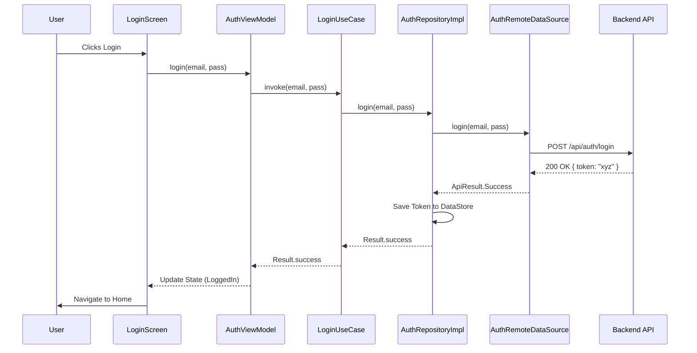
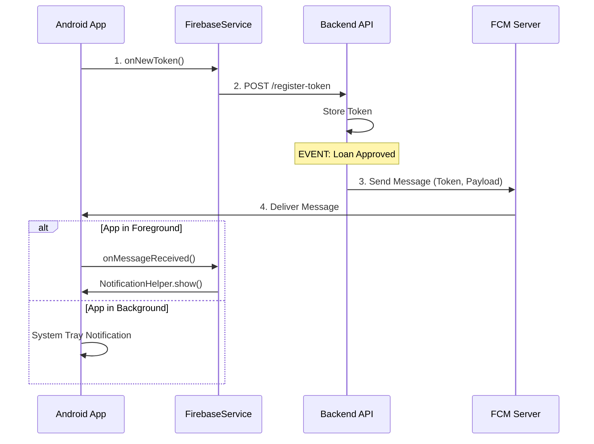

# Bootcamp App Architecture Documentation

## Table of Contents
1. [Overview](#overview)
2. [What to Make (Features)](#what-to-make-features)
3. [Architecture Diagram](#architecture-diagram)
4. [Project Structure](#project-structure)
5. [Architecture Layers](#architecture-layers)
6. [Backend to Android Flow](#backend-to-android-flow)
7. [Offline-First & Caching Strategy](#offline-first--caching-strategy)
8. [Google Sign-In Implementation](#google-sign-in-implementation)
9. [Image Loading (Coil)](#image-loading-coil)
10. [Firebase Integration](#firebase-integration)
11. [Dependency Injection (Hilt)](#dependency-injection-hilt)
12. [Setup Guide](#setup-guide)
13. [Technology Stack Deep Dive](#technology-stack-deep-dive)
14. [Deep Dive: Annotations & Data Flow](#deep-dive-annotations--data-flow)
15. [Push Notification Lifecycle Step-by-Step](#push-notification-lifecycle-step-by-step)
16. [Deep Dive: Camera Implementation & Image Handling](#deep-dive-camera-implementation--image-handling)
17. [Deep Dive: Domain Layer & UseCases](#deep-dive-domain-layer--usecases)

---

## Overview

The Bootcamp application follows **Clean Architecture** principles with **MVVM** (Model-View-ViewModel) presentation pattern. It is designed to be robust, testable, and capable of operating offline.

### Technology Stack

| Category | Technology | Usage |
|----------|------------|-------|
| **Language** | Kotlin | Primary development language |
| **UI Framework** | Jetpack Compose | Modern declarative UI |
| **Architecture** | Clean Architecture + MVVM | Separation of concerns |
| **DI Framework** | Hilt | Dependency Injection for Android & WorkManager |
| **Local Database** | Room | SQLite abstraction for offline caching & queuing |
| **Networking** | Retrofit + OkHttp | REST API communication |
| **Async** | Kotlin Coroutines + Flow | Asynchronous programming & Reactive streams |
| **Auth** | Credential Manager | Google Sign-In & Passkeys support |
| **Image Loading** | Coil | Async image loading for Compose |
| **Sync** | WorkManager | Background synchronization for offline actions |
| **Push Notifications** | Firebase Cloud Messaging (FCM) | Server-to-Client notifications |

---

## What to Make (Features)

The project consists of several core feature modules that form a complete financial application:

### 1. Authentication
- **Login**: Email/Password login and **Google Sign-In**.
- **Register**: Create new account.
- **Forgot Password**: Password recovery flow.
- **Guest Mode**: Limited access experience.

### 2. Dashboard (Home)
- **User Greetings**: Personalized welcome.
- **Credit Overview**: Visual representation of available credit/tier.
- **Quick Actions**: Shortcuts to Loan, Profile, etc.

### 3. Loan Workflow
- **Branch Selection**: Dropdown list of branches (Cached).
- **Loan Application**: Input amount and tenure.
- **Submission**: Online submission or Offline queuing.
- **History**: List of past loan applications with status.

### 4. User Profile
- **View Profile**: Display user details (Name, Email, Address, etc.).
- **Edit Profile**: Update personal information.
- **KTP Upload**: Capture/Select ID image and upload.

---

## Architecture Diagram

```
┌─────────────────────────────────────────────────────────────────┐
│                      PRESENTATION LAYER                          │
│  ┌─────────────┐  ┌─────────────┐  ┌─────────────────────────┐  │
│  │   Screens   │  │  Components │  │      ViewModels         │  │
│  │ (Composable)│  │    (Coil)   │  │    (@HiltViewModel)     │  │
│  └──────┬──────┘  └──────┬──────┘  └───────────┬─────────────┘  │
│         │                │                      │                 │
│         └────────────────┴───┬──────────────────┘                 │
│                              │ observes StateFlow                 │
└──────────────────────────────┼────────────────────────────────────┘
                               │
┌──────────────────────────────┼────────────────────────────────────┐
│                       DOMAIN LAYER                                 │
│                              │                                     │
│  ┌───────────────────────────▼──────────────────────────────────┐  │
│  │                        UseCases                              │  │
│  │        (Single Responsibility Business Logic)                │  │
│  └───────────────────────────┬──────────────────────────────────┘  │
│                              │                                     │
│  ┌───────────────────────────▼──────────────────────────────────┐  │
│  │                 Repository Interfaces                        │  │
│  └───────────────────────────┬──────────────────────────────────┘  │
└──────────────────────────────┼────────────────────────────────────┘
                               │
┌──────────────────────────────┼────────────────────────────────────┐
│                        DATA LAYER                                  │
│                              │                                     │
│  ┌───────────────────────────▼──────────────────────────────────┐  │
│  │               Repository Implementations                     │  │
│  │          (Handles Offline/Online Logic)                      │  │
│  └──────┬────────────────────┬──────────────────────┬───────────┘  │
│         │                    │                      │              │
│  ┌──────▼──────┐      ┌──────▼──────┐        ┌──────▼──────┐       │
│  │    LOCAL    │      │    REMOTE   │        │     SYNC    │       │
│  │ (Room DB)   │◄────►│  (Retrofit) │◄──────►│ (WorkManager)     │ │
│  │ - Entities  │      │ - DTOs      │        │ - SyncWorker      │ │
│  │ - DAOs      │      │ - Service   │        │ - SyncManager     │ │
│  └─────────────┘      └─────────────┘        └───────────────────┘ │
└────────────────────────────────────────────────────────────────────┘
```

---

## Backend to Android Flow

Typical data flow from the Backend API to the Android UI:

1.  **Backend API**: Exposes JSON endpoints (e.g., `GET /api/loans`).
2.  **Retrofit Service (`AuthService`, `LoanService`)**: Defines the HTTP contract in Kotlin interfaces.
3.  **RemoteDataSource**:
    -   Calls Retrofit service.
    -   Wraps response in `ApiResponse<T>`.
    -   Handles HTTP errors (4xx, 5xx) and converts to `ApiResult`.
4.  **Repository (`LoanRepositoryImpl`)**:
    -   **Read**: Checks Network.
        -   If Success: Maps DTOs -> Entities, Saves to **Room**, Returns mapped Domain Models.
        -   If Failure: Fetches from **Room** (Cache), Maps Entities -> Domain Models, Returns.
    -   **Write**:
        -   If Online: Sends to RemoteDataSource.
        -   If Offline: Saves as `PendingEntity` in **Room**, schedules **WorkManager**.
5.  **UseCase**: Receives Domain Models from Repository, applies business rules (if any).
6.  **ViewModel**:
    -   Collects flow from UseCase.
    -   Maps Domain Models -> `UiState`.
    -   Exposes `StateFlow<UiState>`.
7.  **UI (Compose)**: Observes `StateFlow` and redraws.

---

## Offline-First & Caching Strategy

The app distinguishes between **Caching** (Read optimization) and **Offline Support** (Write persistence).

### 1. Caching (Read Strategy)
_Goal: Show data immediately, even without internet._

-   **Pattern**: **Network-Bound Resource** (Simplified).
-   **Implementation**:
    -   Always try to fetch fresh data from the API first.
    -   **On Success**:
        1.  Convert API DTOs to Room Entities.
        2.  `dao.deleteAll()` (Clear old cache).
        3.  `dao.insertAll(newEntities)` (Save new data).
        4.  Return data to UI.
    -   **On Failure** (No internet / Server error):
        1.  Query Room database (`dao.getAll()`).
        2.  If data exists, return `Result.success(cachedData)`.
        3.  If empty, return `Result.failure`.

### 2. Offline Queuing (Write Strategy)
_Goal: Allow users to submit forms (Loan, Profile) while offline._

-   **Entities**: `PendingLoanEntity`, `PendingProfileEntity`.
-   **Status**: Uses `SyncStatus` enum (`PENDING`, `SYNCED`, `FAILED`).
-   **Process**:
    1.  User clicks "Submit".
    2.  Repository checks connectivity.
    3.  **If Offline**:
        -   Create `PendingLoanEntity` with `syncStatus = PENDING`.
        -   Save to local DB.
        -   Trigger `SyncManager.scheduleLoanSync()`.
        -   Return "Success" to UI (Optimistic update or "Queued" message).
    4.  **WorkManager**:
        -   Runs in background when internet becomes available (`NetworkConstraint`).
        -   Reads all `PENDING` entities.
        -   Calls remote API.
        -   On 200 OK: Deletes pending entity or marks `SYNCED`.
        -   On Error: Updates `retryCount` and `errorMessage`.

### 3. Session Management & Security (Data Wiping)
_Goal: Prevent data leakage between users sharing a device._

We enforce a strict **"Force Wipe"** policy to ensure no user data persists across sessions. This is implemented via a **redundant clearing strategy**: we clear on exit (Logout) AND on entry (Login).

#### A. The "Force Wipe" Protocol
When a "Wipe" is triggered, the following functions are executed synchronously to ensure a clean state:

| Component | Function | What it Clears |
| :--- | :--- | :--- |
| **UserProfileRepository** | `clearCache()` | `user_profile_cache`, `pending_profiles` tables (Room) |
| **LoanRepository** | `clearCache()` | `loan_history`, `pending_loans`, `branches` tables (Room) |
| **ProductRepository** | `clearCache()` | `user_product_yield` table (Room) |
| **TokenManager** | `clearToken()` | JWT, User ID, Username, Email (DataStore) |

#### B. Detailed Execution Flow

**1. Secure Logout Sequence**
*Trigger:* User clicks "Logout" in Profile Screen.
1.  **ViewModel**: `AuthViewModel.logout()` launches coroutine.
2.  **UseCase**: `LogoutUseCase.invoke()` is called.
3.  **Step-by-Step Execution**:
    ```kotlin
    // LogoutUseCase.kt
    override suspend fun invoke(): Result<String> {
        // 1. Unregister FCM (Best effort)
        try { fireBaseService.unregister() } catch (e) {}

        // 2. FORCE WIPE LOCAL DATA
        userProfileRepository.clearCache() // Wipes Profile DB
        loanRepository.clearCache()        // Wipes Loan DB
        productRepository.clearCache()     // Wipes Product DB

        // 3. WIPE TOKENS & SESSION
        return authRepository.logout()     // Clears DataStore
    }
    ```

**2. Fail-Safe Login Sequence (The Zombie Guard)**
*Trigger:* User attempts to Log In (Email/Google).
*Purpose:* Handles cases where the app crashed/died before a clean Logout could finish.

1.  **UseCase**: `LoginUseCase.invoke()` (or `GoogleLoginUseCase`) is called.
2.  **Step 1: Pre-emptive Wipe**:
    ```kotlin
    // LoginUseCase.kt
    override suspend fun invoke(params: LoginParams): Result<String> {
        // CRITICAL: Always wipe before accepting new credentials
        try {
            userProfileRepository.clearCache()
            loanRepository.clearCache()
            productRepository.clearCache()
        } catch (e: Exception) {
            // Log warning but allow login to proceed
        }

        // Step 2: Proceed with actual network login
        return authRepository.login(...)
    }
    ```
3.  **Result**: The new user *guaranteed* starts with an empty database.

---

## Google Sign-In Implementation

We use the modern **Credential Manager** API for seamless Google Authentication.

### Key Components
-   **Credential Manager**: `androidx.credentials.CredentialManager`.
-   **GoogleIdTokenCredential**: Used to retrieve the ID Token.
-   **Config**: `GOOGLE_WEB_CLIENT_ID` (Defined in `local.properties`).

### Flow
1.  **Configuration**:
    When the app builds, `GOOGLE_WEB_CLIENT_ID` is injected into `BuildConfig`.
    ```kotlin
    val googleIdOption = GetGoogleIdOption.Builder()
        .setServerClientId(BuildConfig.GOOGLE_WEB_CLIENT_ID)
        .setFilterByAuthorizedAccounts(false)
        .build()
    ```

2.  **Request**:
    `LoginScreen` triggers `credentialManager.getCredential()`.

3.  **Handling Result**:
    -   User selects Google Account.
    -   Google returns an **ID Token**.
    -   **ViewModel** sends this ID Token to Backend (`/api/auth/google`).
    -   **Backend** validates token with Google, creates/finds user, and returns JWT.

4.  **Guest Mode**:
    -   Simple bypass logic in `LoginScreen`.
    -   Navigates to Home without a token (or with a guest token if backend supports it).

---

## Image Loading (Coil)

We use **Coil (Coroutine Image Loader)** for efficient, asynchronous image loading in Jetpack Compose.

### Usage
Used primarily for:
-   User Profile Pictures (from KTP or avatar).
-   Branch logos (if applicable).
-   Status icons.

### Implementation
```kotlin
AsyncImage(
    model = ImageRequest.Builder(LocalContext.current)
        .data(imageUrl)
        .crossfade(true)
        .error(R.drawable.ic_placeholder)
        .build(),
    contentDescription = "Profile Picture",
    modifier = Modifier.clip(CircleShape)
)
```

### Why Coil?
-   **Kotlin-first**: Built with Coroutines.
-   **Lightweight**: Minimal dependencies.
-   **Lifecycle Aware**: Automatically cancels requests when composables are disposed.

---

## Firebase Integration

### 1. Push Notifications (FCM)
-   **Service**: `BootcampFirebaseMessagingService` extends `FirebaseMessagingService`.
-   **Tokens**:
    -   On App Start: Generates `fcmToken`.
    -   On Login: Sends `fcmToken` + `jwt` to Backend (`/api/notifications/register`).
    -   On Logout: Calls unregister endpoint.
-   **Handling**:
    -   **Foreground**: `onMessageReceived` triggers a local notification.
    -   **Background**: System tray notification handled by Firebase SDK.

### 2. Analytics
-   Basic usage of `FirebaseAnalytics` to track app opens and screen views.

---

## Dependency Injection (Hilt)

Hilt manages the object lifecycle and graph.

### Modules (`di/` package)
-   **`AppModule`**:
    -   `@Singleton` types like `DataStore`, `TokenManager`, `Gson`.
-   **`NetworkModule`**:
    -   `Retrofit`, `OkHttpClient` (with `HttpLoggingInterceptor` & `CsrfInterceptor`).
    -   API Services (`AuthService`, `LoanService`).
-   **`DatabaseModule`**:
    -   `AppDatabase` (@Singleton).
    -   DAOs (`UserDao`, `BranchDao`, `PendingLoanDao`).
-   **`RepositoryModule`**:
    -   Binds interfaces to implementations (e.g., `LoanRepository` -> `LoanRepositoryImpl`).

---

## Setup Guide

1.  **Environment Variables**:
    Create a `local.properties` file in the root directory:
    ```properties
    sdk.dir=C\:\\Users\\YourUser\\AppData\\Local\\Android\\Sdk
    BASE_URL=http://192.168.1.5:8081
    GOOGLE_WEB_CLIENT_ID=your-google-client-id.apps.googleusercontent.com
    ```

2.  **Firebase Setup**:
    -   Get `google-services.json` from Firebase Console.
    -   Place it in `app/google-services.json`.

3.  **Build & Run**:
    -   Run `Sync Project with Gradle Files`.
    -   Select device and run (ensure Backend is running if using `locahost`).

---

## Technology Stack Deep Dive

Here is a detailed explanation of each technology used, how it works, and how we apply it in this project.

### 1. Kotlin & Coroutines
- **What it is**: Kotlin is a modern, statically typed language. Coroutines are light-weight threads for asynchronous programming.
- **How it works**: Coroutines allow writing async code sequentially using `suspend` functions. They don't block the main thread, making them ideal for network and database operations.
- **Our Usage**:
  - `suspend fun` in Repositories (e.g., `LoanRepository.submitLoan`).
  - `viewModelScope.launch` in ViewModels to trigger operations without leaking memory.
  - `Flow` for reactive data streams (e.g., observing `getPendingLoans` updates from Room).

### 2. Jetpack Compose
- **What it is**: Android's modern toolkit for building native UI using declarative code.
- **How it works**: You describe *what* the UI should look like for a given state, not *how* to mutate it. When state changes, Compose "recomposes" (redraws) only the parts that changed.
- **Our Usage**:
  - `Screens` (e.g., `LoginScreen`) are simple functions that take state and event callbacks.
  - `Components` (e.g., `GlassCard`, `PrimaryButton`) are reusable UI pieces.
  - No XML layouts are used; everything is Kotlin code in `ui/`.

### 3. Hilt (Dependency Injection)
- **What it is**: A DI library built on top of Dagger to reduce boilerplate.
- **How it works**: It creates a graph of dependencies. You define "Modules" that tell Hilt how to create instances (e.g., "Here is how to make an OkHttpClient"). You then request these instances using `@Inject`.
- **Our Usage**:
  - `@HiltAndroidApp` on `BootcampApplication` triggers code generation.
  - `@Inject constructor` in `AuthRepositoryImpl` allows it to receive `AuthService` automatically.
  - `AppModule` provides singleton instances like `TokenManager`.
  - Simplifies testing by allowing us to easily swap real implementations for mocks.

### 4. Room (Local Database)
- **What it is**: An abstraction layer over SQLite for robust database access.
- **How it works**: You define:
  - **Entities**: Data classes acting as tables (e.g., `PendingLoanEntity`).
  - **DAOs**: Interface with SQL queries (e.g., `SELECT * FROM pending_loans`).
- **Our Usage**:
  - Caching branches and loan history for offline viewing.
  - Storing pending submissions (`PendingLoanEntity`) when the device is offline.
  - Returns `Flow<List<T>>` to automatically update the UI when DB data changes.

### 5. Retrofit & OkHttp (Networking)
- **What it is**: Retrofit turns HTTP APIs into Kotlin interfaces. OkHttp is the underlying HTTP client.
- **How it works**: You define an interface method `@POST("login")` and Retrofit generates the network code. OkHttp handles the connection, headers, and interceptors.
- **Our Usage**:
  - `AuthService` interface defines endpoints.
  - `NetworkModule` configures `OkHttpClient` with:
    - `HttpLoggingInterceptor` for debugging.
    - `CsrfInterceptor` for security headers.
  - Handles JSON parsing automatically via Gson converter.

### 6. WorkManager (Background Sync)
- **What it is**: Library for deferrable, guaranteed background work.
- **How it works**: You define a `Worker`. You request the OS to run it "one-time" or "periodically" with constraints (e.g., "Run only when connected to Internet").
- **Our Usage**:
  - `SyncManager` schedules a `OneTimeWorkRequest` when a user submits a form offline.
  - The Worker runs when the network returns, reads `PendingEntity` from Room, sends it to the server, and updates the local status.

### 7. Jetpack DataStore (Preferences)
- **What it is**: A modern data storage solution replacing SharedPreferences.
- **How it works**: Stores key-value pairs or typed objects asynchronously using Coroutines and Flow.
- **Our Usage**:
  - `TokenManager` uses `DataStore<Preferences>` to persist:
    - JWT Access Token (`jwt_token`).
    - User details (Name, Email).
    - CSRF Token.

### 8. Coil (Image Loading)
- **What it is**: An image loading library for Android backed by Kotlin Coroutines.
- **How it works**: It handles fetching images from URLs, caching them in memory/disk, and displaying them.
- **Our Usage**:
  - `AsyncImage` composable is used to load User Profile pictures and arbitrary URLs.
  - Handles network failures gracefully with `error` placeholders.

---

## Deep Dive: Annotations & Data Flow

This section breaks down the specific annotations used in the project and provides a concrete example of how data travels from the backend to your screen.

### 1. Key Annotations Explained

| Annotation | What it does | How we use it |
|------------|--------------|---------------|
| **`@HiltAndroidApp`** | Triggers Hilt's code generation. Must be absent on the `Application` class. | In `BootcampApplication.kt`, it sets up the DI container for the entire app. |
| **`@AndroidEntryPoint`** | Tells Hilt to inject dependencies into an Android Class (Activity, Fragment, Service). | In `MainActivity.kt`, allowing it to inject ViewModels later in the navigation graph. |
| **`@HiltViewModel`** | Marks a ViewModel to be injectable by Hilt. | In `AuthViewModel`, allowing Hilt to provide `UseCases` automatically. |
| **`@Inject`** | Requests a dependency. | `class AuthRepositoryImpl @Inject constructor(...)` - "Hey Hilt, please give me my dependencies when you create me." |
| **`@Module`** | logical container for telling Hilt how to provide instances. | `NetworkModule.kt` is a module that knows how to create Retrofit and OkHttp instances. |
| **`@InstallIn`** | Specifies the scope/lifecycle of a Module. | `@InstallIn(SingletonComponent::class)` means dependencies live as long as the App lives (Singletons). |
| **`@Singleton`** | Guarantees only **ONE** instance of this object is created and shared app-wide. | `AppDatabase` is a Singleton; we don't want multiple database connections open. |
| **`@Binds`** | Efficiently maps an Interface to an Implementation. | In `RepositoryModule`, it says: "Whenever someone asks for `AuthRepository` (interface), give them `AuthRepositoryImpl`." |
| **`@Body`** | (Retrofit) Puts an object into the HTTP Request Body (JSON). | `login(@Body request: LoginRequest)` sends the user object as JSON. |
| **`@GET` / `@POST`** | (Retrofit) Defines the HTTP Method and Endpoint. | `@POST("auth/login")` |

---

### 2. End-to-End Flow Example: "Submitting a Loan"

Let's trace exactly what happens when a user clicks **"Submit Loan"** until the success message appears.

#### **Step 1: User Interaction (The Trigger)**
- **File**: `SubmitLoanScreen.kt`
- **Action**: User clicks the "Submit" button.
- **Code**:
  ```kotlin
  Button(onClick = { viewModel.submitLoan(amount, tenure) }) { ... }
  ```
- **What happens**: The UI Event is sent to the **ViewModel**.

#### **Step 2: ViewModel (The Decision Maker)**
- **File**: `LoanViewModel.kt` (@HiltViewModel)
- **Action**: ViewModel launches a coroutine (`viewModelScope`) to keep the UI responsive.
- **Code**:
  ```kotlin
  fun submitLoan(amount: Long, tenure: Int) {
      viewModelScope.launch {
          _uiState.value = UiState.Loading // 1. Show Loading Spinner
          val result = submitLoanUseCase(amount, tenure) // 2. Call Domain Layer
          // ... handle result
      }
  }
  ```
- **Dependency**: The `SubmitLoanUseCase` was injected by Hilt.

#### **Step 3: UseCase (The Business Logic)**
- **File**: `SubmitLoanUseCase.kt`
- **Action**: Validates rules (e.g., "Is amount > 0?").
- **Code**:
  ```kotlin
  operator suspend fun invoke(amount: Long, tenure: Int): Result<String> {
      if (amount <= 0) return Result.failure(...)
      return loanRepository.submitLoan(amount, tenure) // Call Data Layer
  }
  ```
- **Dependency**: The `LoanRepository` (Interface) was injected.

#### **Step 4: Repository ( The Data Coordinator)**
- **File**: `LoanRepositoryImpl.kt` (@Singleton)
- **Action**: Hilt provides this implementation because of `@Binds` in `RepositoryModule`.
- **Logic**:
  1.  **Check Internet**: Uses `NetworkMonitor`.
  2.  **If Online**: Call `RemoteDataSource`.
  3.  **If Offline**: Save `PendingLoanEntity` to Room (`queueLoanForOfflineSync`).

#### **Step 5: Remote Data Source (The Network Caller)**
- **File**: `LoanRemoteDataSource.kt`
- **Action**: Calls the Retrofit Service.
- **Code**:
  ```kotlin
  return loanService.submitLoan(token, request)
  ```

#### **Step 6: Retrofit Service (The API Hit)**
- **File**: `LoanService.kt`
- **Action**: Converts the call into an actual HTTP Request.
- **Annotation**: `@POST("loans/submit")`
- **Network Traffic**:
  ```json
  POST https://api.bootcamp.com/loans/submit
  Headers: Authorization: Bearer eyJhbG...
  Body: { "amount": 5000000, "tenure": 6 }
  ```

#### **Step 7: Backend Response**
- **Server**: Processes request...
- **Response**:
  ```json
  200 OK
  { "success": true, "message": "Loan Submitted", "data": { "id": 101 } }
  ```

#### **Step 8: Return Trip (Back to UI)**
1.  **Retrofit**: Parses JSON -> `LoanResponseDto`.
2.  **RemoteDataSource**: Returns `ApiResult.Success(dto)`.
3.  **Repository**:
    -   Maps `LoanResponseDto` -> `LoanApplication` (Domain Model).
    -   **Saves to Room** (Caching the new loan so it shows up in history immediately).
    -   Returns `Result.success("Loan Submitted")`.
4.  **UseCase**: Returns `Result.success(...)`.
5.  **ViewModel**:
    ```kotlin
    _uiState.update {
        it.copy(isLoading = false, successMessage = result.getOrNull())
    }
    ```

#### **Step 9: UI Update (The Result)**
- **File**: `SubmitLoanScreen.kt`
- **Action**: Compose detects the state change (`uiState.successMessage` is not null).
- **Result**: Even though the ViewModel didn't "tell" the UI to update, the UI was **observing** the state. The screen automatically recomposes to show the Success Dialog or Toast.



### 15. Push Notification Lifecycle Step-by-Step

This section explains the exact journey of a push notification, from the moment the app starts to when the user sees it on their screen.

#### 1. App Start & Token Generation (The Setup)
- **Signal**: App launch or App Installation.
- **Component**: `BootcampFirebaseMessagingService.kt`
- **Action**: The Firebase SDK generates a unique **FCM Registration Token** for this device.
- **Code**: `onNewToken(token)` method is triggered.
- **Backend Sync**:
  1.  Service checks if the user is `isLoggedIn` (via `TokenManager`).
  2.  **If Logged In**: Calls `sendTokenToServer(token)`.
  3.  **API Hit**: `POST /api/notifications/register` with `{ "token": "xyz...", "device": "Pixel 7" }`.
  4.  **Backend**: Stores this token against the User ID in its database.

#### 2. Backend Trigger (The Signal)
- **Scenario**: A user's loan is approved/rejected, or a promotion is created.
- **Signal**: An event occurs on the server (e.g., `LoanService.approveLoan()`).
- **Backend Action**:
  1.  Finds the target user's FCM Token from the database.
  2.  Constructs a payload:
      ```json
      {
        "to": "FCM_TOKEN",
        "priority": "high",
        "notification": {
          "title": "Loan Approved",
          "body": "Your loan of $500 has been approved!"
        },
        "data": {
          "type": "LOAN_STATUS_CHANGE",
          "loanId": "123"
        }
      }
      ```
  3.  Sends this payload to **Firebase Cloud Messaging Server** (Google's Server).

#### 3. Arrival at Device (The Reception)
- **Role**: Google Play Services maintains a persistent connection to FCM Servers.
- **Scenario A: App is in Foreground**
  -   **Component**: `BootcampFirebaseMessagingService`
  -   **Method**: `onMessageReceived(remoteMessage)` is called.
  -   **Logic**:
      -   Logs the message.
      -   Calls `NotificationHelper.showNotification()`.
  -   **Custom Handling**: If `data["type"] == "transaction"`, it might use a specific notification channel or navigate specifically.

-   **Scenario B: App is in Background / Killed**
    -   **System Tray**: Android System automatically handles the `notification` block and displays it in the system tray.
    -   **User Tap**: When user taps the notification, the `data` payload is passed as `Intent` extras to the default Activity (`MainActivity`), which can then handle navigation.

#### 4. Displaying to User (The UI)
-   **Component**: `NotificationHelper.kt`
-   **Action**: Builds the actual Android Notification.
-   **Channels**:
    -   **`default_channel`**: Standard importance.
    -   **`transactions_channel`**: High importance (makes sound/vibrates even in some DND modes).
-   **Code**:
    ```kotlin
    val notification = NotificationCompat.Builder(context, channelId)
        .setContentTitle(title)
        .setContentText(message)
        .setSmallIcon(R.drawable.ic_launcher_foreground)
        .build()
    notificationManager.notify(id, notification)
    ```

#### 5. Summary Flow


### 16. Deep Dive: Camera Implementation & Image Handling

We use the modern **Activity Result API** within Jetpack Compose to handle camera permissions and captures.

#### 1. Invoking the Camera (`EditProfileScreen.kt`)
Instead of using the old `Intent(MediaStore.ACTION_IMAGE_CAPTURE)`, we use the contract `ActivityResultContracts.TakePicture`.

**Key Components**:
-   **FileProvider**: Required to share a file URI with the camera app securely.
-   **Temporary File**: We creating a temp file in the app's cache directory.
-   **State Restoration**: We use `rememberSaveable` to ensure the URI survives "Process Death" (e.g., if the OS kills our app to free memory for the Camera app).

**Step-by-Step**:
1.  **Permission Check**: User clicks "Camera". App checks `Manifest.permission.CAMERA`.
2.  **URI Creation**:
    ```kotlin
    fun createTempUri(): Uri {
        val tempFile = File.createTempFile("ktp_capture", ".jpg", context.cacheDir)
        return FileProvider.getUriForFile(
            context,
            "${context.packageName}.fileprovider",
            tempFile
        )
    }
    ```
3.  **Launch Camera**:
    ```kotlin
    val cameraLauncher = rememberLauncherForActivityResult(TakePicture()) { success ->
        if (success) viewModel.onKtpFileSelected(tempUri)
    }
    cameraLauncher.launch(tempUri)
    ```

#### 2. Handling the Image Result
When the user snaps a photo and hits "OK":
1.  **Callback**: Matches the `tempUri` we created earlier.
2.  **Action**: `viewModel.onKtpFileSelected(uri)` is called.
3.  **Immediate Upload**:
    The app attempts to upload the image **immediately** to the server.
    ```kotlin
    // EditProfileViewModel.kt
    userProfileRepository.uploadKtp(uri).onSuccess { path ->
         _uiState.update { it.copy(ktpPath = path) }
    }
    ```

#### 3. Offline vs. Online Behavior (Important)
There is a distinction between how we handle the **Profile Data** and the **Image File**.

| Feature | Online Behavior | Offline Behavior |
|---------|-----------------|------------------|
| **Profile Data** (Address, Name) | Sent to Backend immediately. | Saved to **Room** (`PendingProfileEntity`). Queued for sync. |
| **KTP Image Upload** | Uploaded immediately via Multipart. returns a `path` string. | **Fails immediately**. User cannot upload a *new* image while offline. |

**The "Why"**:
-   Images are large binary files. Queuing them requires converting to ByteArrays or keeping stable file paths and managing complex background uploads with retries.
-   **Current Strategy**: We require a stable internet connection for the heavy lifting (image upload) but allow the lightweight data entry (forms) to happen offline.

#### 4. How the Image is "Stored" in Room
When syncing the profile data offline:
-   **Room Entity**: `PendingProfileEntity` contains a field `val ktpPath: String`.
-   **Logic**:
    -   If the user **already has** a KTP on the server, `ktpPath` is a URL.
    -   If the user just uploaded a new one (must be online), `ktpPath` is the new URL returned by the upload API.
    -   This string path is what gets queued in the database. The database **does not** store the image binary (BLOB).

### 17. Deep Dive: Domain Layer & UseCases

The **UseCase** is a critical part of Clean Architecture. It resides in the **Domain Layer** (Pure Kotlin, no Android dependencies) and acts as the "Traffic Cop" for business logic.

#### What is a UseCase?
It is a class designated to perform **one specific action** for the user. It embodies the Single Responsibility Principle.

-   **Naming Convention**: `Verb` + `Noun` + `UseCase` (e.g., `SubmitLoanUseCase`, `LoginUseCase`).
-   **Input**: Takes specific parameters (e.g., `SubmitLoanParams`).
-   **Output**: Returns a `Result<T>`.

#### Why is it Critical?
1.  **Isolation**: It ensures business rules (e.g., "Amount must be > 0", "User must be over 18") are checked **before** touching the database or network.
2.  **Reusability**: `SubmitLoanUseCase` can be called from multiple places (UI, Background Service, or another UseCase) without rewriting logic.
3.  **Testability**: Because it has no Android dependencies, it is incredibly easy to unit test. You just mock the Repository.

#### Example from Code: `SubmitLoanUseCase.kt`

```kotlin
// 1. Defined in 'domain' package (No Android imports!)
class SubmitLoanUseCase @Inject constructor(
    private val loanRepository: LoanRepository // 2. Depends on Interface, not Implementation
) {

    // 3. 'operator fun invoke' makes the class callable like a function
    suspend operator fun invoke(amount: Long, tenure: Int): Result<String> {

        // 4. Input Validation (Business Logic)
        if (amount <= 0) {
            return Result.failure(IllegalArgumentException("Amount must be positive"))
        }

        // 5. Delegate to Repository for Data Operations
        return loanRepository.submitLoan(amount, tenure)
    }
}
```

#### The Execution Flow
1.  **ViewModel** calls `useCase(amount, tenure)`.
2.  **UseCase** checks validation rules.
    -   If invalid -> Returns `Failure` immediately.
    -   If valid -> Calls `repository.submitLoan()`.
3.  **Repository** decides whether to use Remote API or Local Database (Offline).
4.  **ViewModel** gets the final `Result` and updates the UI.

Without the UseCase, all this validation logic would sit in the **ViewModel**. Over time, ViewModels become "God Classes" that are hard to read and test. The UseCase layer prevents this.
