# Implementation Flow Diagram
## STAR Financial App Screen Redesign

This document provides visual representations of the implementation flow and component relationships.

---

## 📊 Implementation Phase Flow

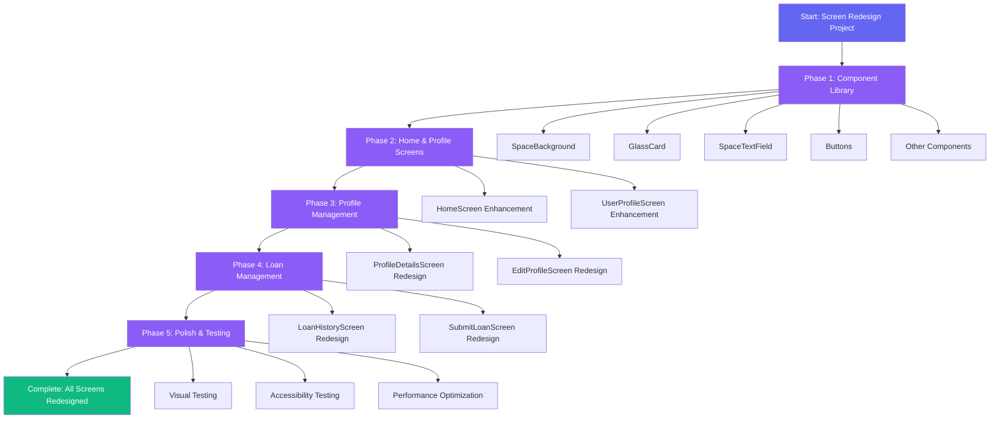

---

## 🏗️ Component Hierarchy

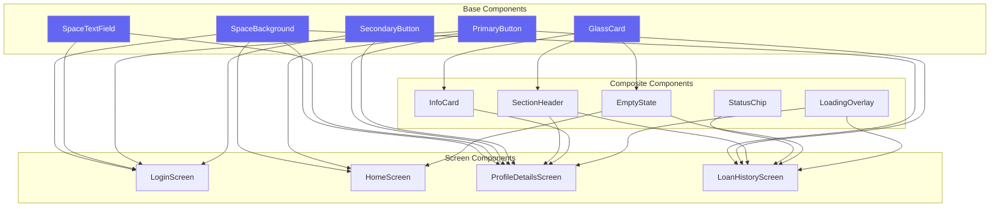

---

## 🎨 Design System Structure

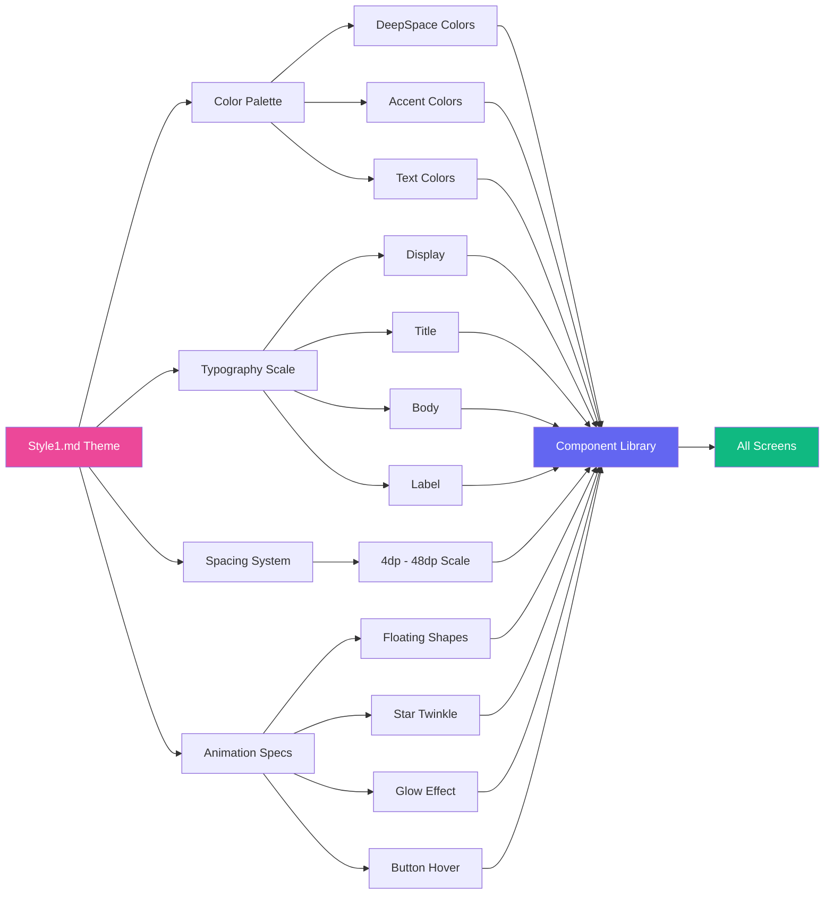

---

## 📱 Screen State Flow

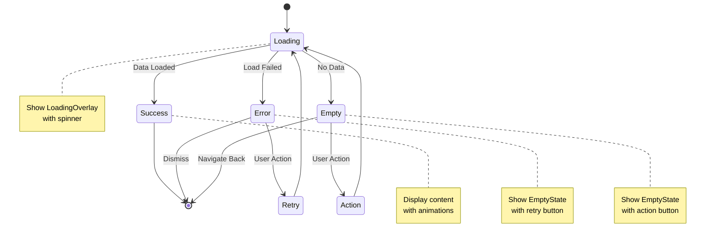

---

## 🔄 Responsive Layout Breakpoints

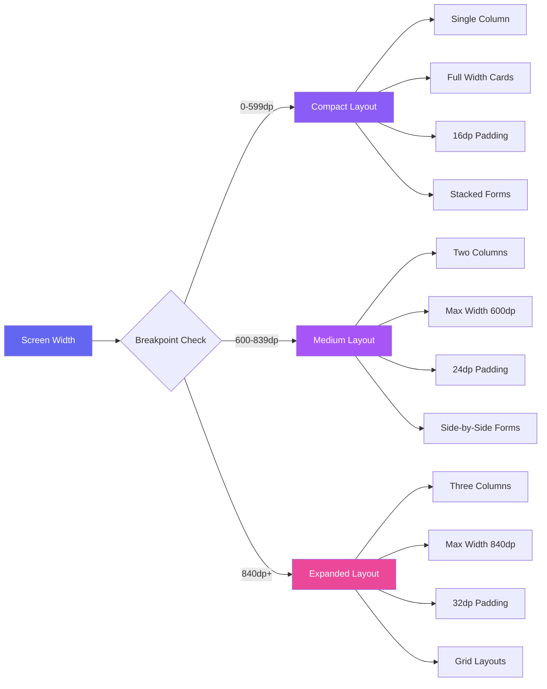

---

## 🎯 Screen Redesign Priority

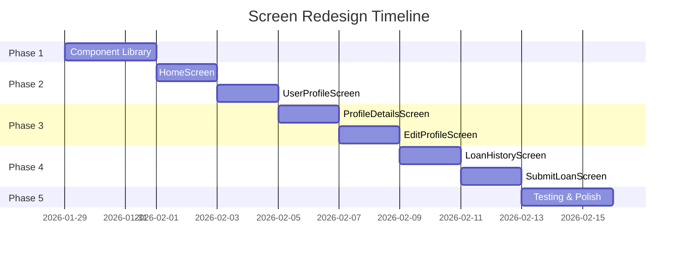

---

## 🧩 Component Dependency Graph

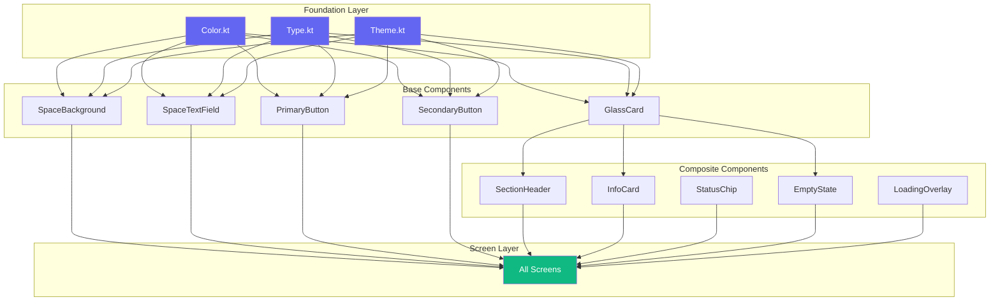

---

## 🎨 Glassmorphism Effect Layers

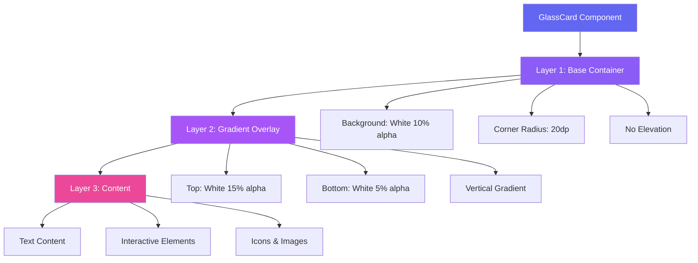

---

## 🔐 Accessibility Implementation Flow

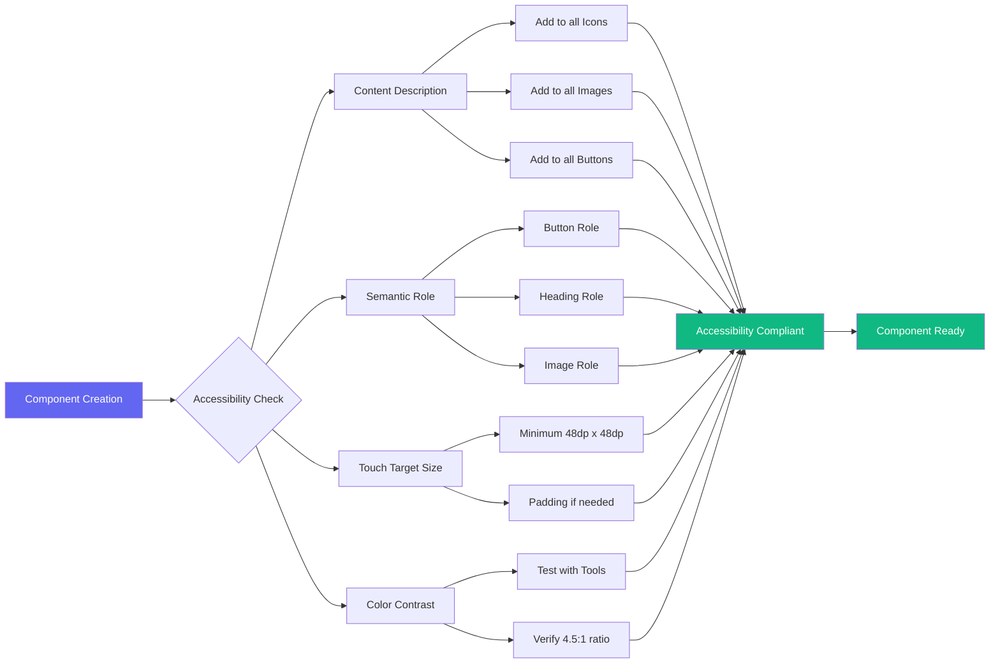

---

## 📊 Testing Strategy Flow

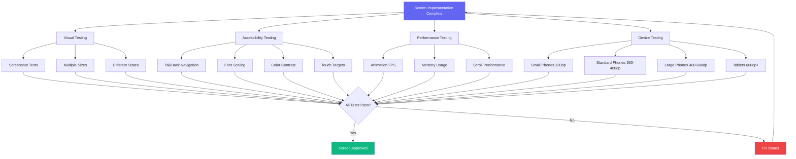

---

## 🎬 Animation Timeline

```mermaid
gantt
    title Animation Sequence on Screen Load
    dateFormat  SS
    section Background
    Star Field Fade In          :00, 1s
    Floating Shape 1 Start      :00, 6s
    Floating Shape 2 Start      :00, 8s
    Floating Shape 3 Start      :00, 10s
    section Content
    Title Glow Start            :01, 3s
    Card Fade In                :01, 0.3s
    Content Slide In            :01, 0.3s
    section Interactive
    Button Hover Ready          :02, 1s
```

---

## 🔄 Component Reusability Matrix

| Component | LoginScreen | HomeScreen | ProfileDetails | EditProfile | LoanHistory | SubmitLoan |
|-----------|-------------|------------|----------------|-------------|-------------|------------|
| SpaceBackground | ✅ | ✅ | ✅ | ✅ | ✅ | ✅ |
| GlassCard | ✅ | ✅ | ✅ | ✅ | ✅ | ✅ |
| SpaceTextField | ✅ | ❌ | ❌ | ✅ | ❌ | ✅ |
| PrimaryButton | ✅ | ✅ | ✅ | ✅ | ✅ | ✅ |
| SecondaryButton | ✅ | ❌ | ❌ | ✅ | ❌ | ✅ |
| SectionHeader | ❌ | ❌ | ✅ | ✅ | ✅ | ❌ |
| InfoCard | ❌ | ❌ | ✅ | ❌ | ❌ | ❌ |
| StatusChip | ❌ | ❌ | ❌ | ❌ | ✅ | ❌ |
| EmptyState | ❌ | ✅ | ✅ | ❌ | ✅ | ❌ |
| LoadingOverlay | ✅ | ✅ | ✅ | ✅ | ✅ | ✅ |

**Legend:**
- ✅ Used in this screen
- ❌ Not used in this screen

---

## 📐 Layout Composition Example

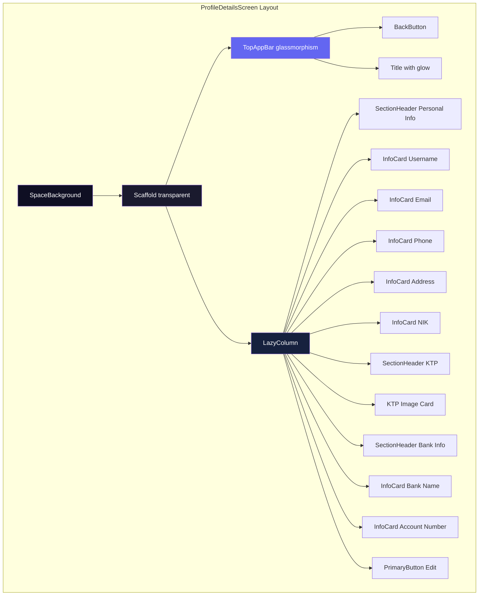

---

## 🎨 Color Usage Guide

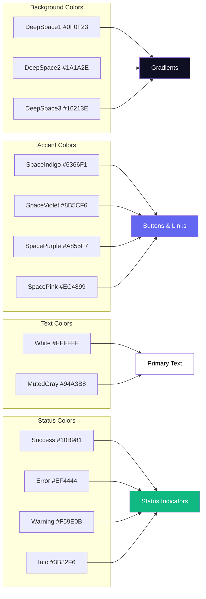

---

**Document Version**: 1.0  
**Last Updated**: 2026-01-29  
**Author**: Kilo Code (Architect Mode)
