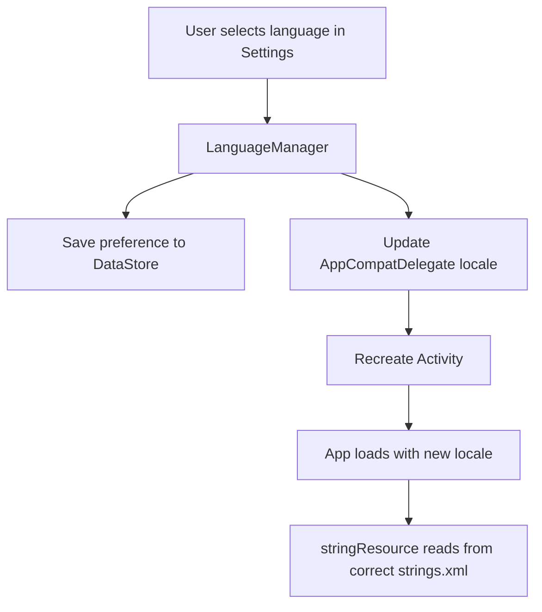
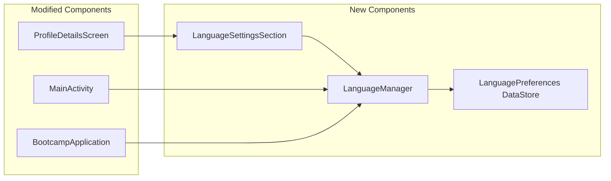
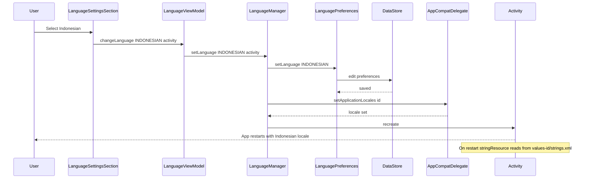
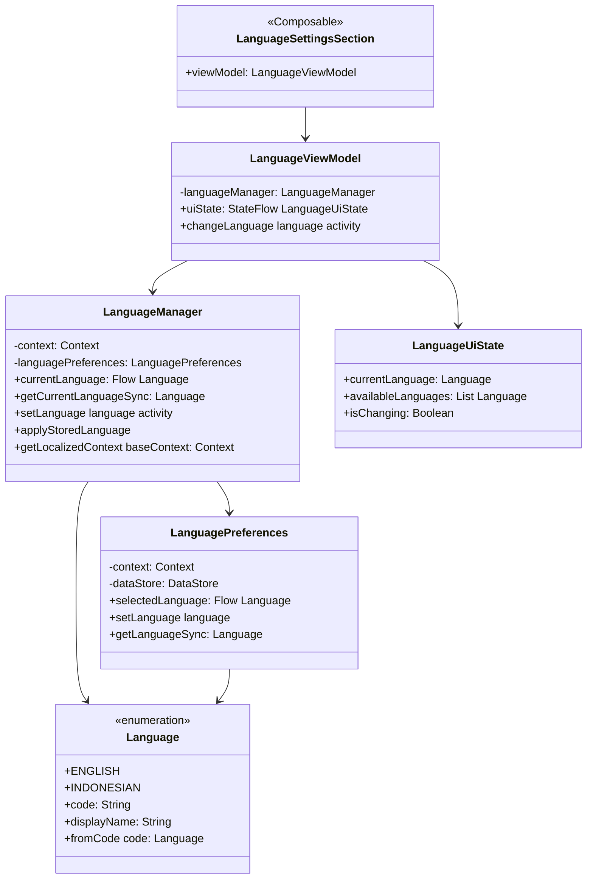

# Localization Implementation Plan

## Overview
This document outlines the implementation plan for adding multi-language support (English and Indonesian) to the Bootcamp Android application. Currently, the app has hardcoded strings mixed between English and Indonesian throughout the UI.

## Current State Analysis

### Language Mix Issues Found
The application currently has a mix of:
- **Indonesian strings**: Used in HomeScreen, SubmitLoanScreen, UserProfileScreen
- **English strings**: Used in LoginScreen, RegisterScreen, ProfileDetailsScreen, LoanHistoryScreen, EditProfileScreen

---

## Complete List of Hardcoded Strings to Extract

### 1. HomeScreen.kt

| String (Current) | Language | Suggested Key | English | Indonesian |
|-----------------|----------|---------------|---------|------------|
| `"Hi, ${uiState.username}"` | EN | `home_greeting_user` | Hi, %s | Hai, %s |
| `"Hi, Guest"` | EN | `home_greeting_guest` | Hi, Guest | Hai, Tamu |
| `"Kelola pinjamanmu dengan lebih mudah."` | ID | `home_subtitle` | Manage your loans more easily. | Kelola pinjamanmu dengan lebih mudah. |
| `"Pilih Produk Pinjaman"` | ID | `home_select_product` | Select Loan Product | Pilih Produk Pinjaman |
| `"Bronze"` | EN | `tier_bronze` | Bronze | Bronze |
| `"Silver"` | EN | `tier_silver` | Silver | Silver |
| `"Gold"` | EN | `tier_gold` | Gold | Gold |
| `"Simulasi ${product.name}"` | ID | `loan_simulation_title` | %s Simulation | Simulasi %s |
| `"Max Limit: ${formatter.format(product.limitRupiah)}"` | EN | `loan_max_limit` | Max Limit: %s | Limit Maks: %s |
| `"Pinjaman (Rp)"` | ID | `loan_amount_label` | Loan Amount (Rp) | Pinjaman (Rp) |
| `"Tenor (Bulan)"` | ID | `loan_tenor_label` | Tenor (Months) | Tenor (Bulan) |
| `"Max: ${product.maxTenorMonth} bln"` | ID | `loan_max_tenor` | Max: %d months | Maks: %d bln |
| `"Estimasi Cicilan per Bulan"` | ID | `loan_monthly_estimate` | Estimated Monthly Installment | Estimasi Cicilan per Bulan |
| `"Ajukan Sekarang"` | ID | `loan_apply_now` | Apply Now | Ajukan Sekarang |

### 2. LoginScreen.kt

| String (Current) | Language | Suggested Key | English | Indonesian |
|-----------------|----------|---------------|---------|------------|
| `"STAR"` | EN | `app_logo_title` | STAR | STAR |
| `"Financial"` | EN | `app_logo_subtitle` | Financial | Financial |
| `"Welcome Back"` | EN | `login_welcome` | Welcome Back | Selamat Datang Kembali |
| `"Sign in to continue"` | EN | `login_subtitle` | Sign in to continue | Masuk untuk melanjutkan |
| `"Email or Username"` | EN | `login_email_username_label` | Email or Username | Email atau Username |
| `"Password"` | EN | `login_password_label` | Password | Kata Sandi |
| `"Hide password"` | EN | `password_hide` | Hide password | Sembunyikan kata sandi |
| `"Show password"` | EN | `password_show` | Show password | Tampilkan kata sandi |
| `"Forgot Password?"` | EN | `login_forgot_password` | Forgot Password? | Lupa Kata Sandi? |
| `"Sign In"` | EN | `login_button` | Sign In | Masuk |
| `"Sign in with Google"` | EN | `login_google` | Sign in with Google | Masuk dengan Google |
| `"Don't have an account? "` | EN | `login_no_account` | Don't have an account? | Belum punya akun? |
| `"Sign Up"` | EN | `login_signup_link` | Sign Up | Daftar |
| `"Invalid Client ID config"` | EN | `error_invalid_client_id` | Invalid Client ID config | Konfigurasi Client ID tidak valid |

### 3. RegisterScreen.kt

| String (Current) | Language | Suggested Key | English | Indonesian |
|-----------------|----------|---------------|---------|------------|
| `"Back"` | EN | `navigation_back` | Back | Kembali |
| `"Create Account"` | EN | `register_title` | Create Account | Buat Akun |
| `"Join STAR Financial today"` | EN | `register_subtitle` | Join STAR Financial today | Bergabung dengan STAR Financial hari ini |
| `"Username"` | EN | `register_username_label` | Username | Nama Pengguna |
| `"Username must be 3-50 characters"` | EN | `error_username_length` | Username must be 3-50 characters | Username harus 3-50 karakter |
| `"Email"` | EN | `register_email_label` | Email | Email |
| `"Please enter a valid email"` | EN | `error_invalid_email` | Please enter a valid email | Masukkan email yang valid |
| `"Password must be at least 8 characters"` | EN | `error_password_length` | Password must be at least 8 characters | Kata sandi minimal 8 karakter |
| `"Confirm Password"` | EN | `register_confirm_password_label` | Confirm Password | Konfirmasi Kata Sandi |
| `"Passwords do not match"` | EN | `error_password_mismatch` | Passwords do not match | Kata sandi tidak cocok |
| `"Already have an account? "` | EN | `register_has_account` | Already have an account? | Sudah punya akun? |

### 4. ForgotPasswordScreen.kt

| String (Current) | Language | Suggested Key | English | Indonesian |
|-----------------|----------|---------------|---------|------------|
| `"Recover"` | EN | `forgot_password_title` | Recover | Pulihkan |
| `"Reset Password"` | EN | `forgot_password_card_title` | Reset Password | Atur Ulang Kata Sandi |
| `"Enter your email address and we'll send you instructions to reset your password."` | EN | `forgot_password_description` | Enter your email address and we'll send you instructions to reset your password. | Masukkan alamat email Anda dan kami akan mengirimkan instruksi untuk mengatur ulang kata sandi. |
| `"Send Reset Link"` | EN | `forgot_password_button` | Send Reset Link | Kirim Link Reset |

### 5. ProfileDetailsScreen.kt

| String (Current) | Language | Suggested Key | English | Indonesian |
|-----------------|----------|---------------|---------|------------|
| `"Profile Details"` | EN | `profile_details_title` | Profile Details | Detail Profil |
| `"Failed to load profile"` | EN | `error_load_profile` | Failed to load profile | Gagal memuat profil |
| `"Unknown error"` | EN | `error_unknown` | Unknown error | Kesalahan tidak diketahui |
| `"Retry"` | EN | `button_retry` | Retry | Coba Lagi |
| `"Personal Information"` | EN | `profile_personal_info` | Personal Information | Informasi Pribadi |
| `"Username"` | EN | `profile_username` | Username | Nama Pengguna |
| `"Email"` | EN | `profile_email` | Email | Email |
| `"Phone Number"` | EN | `profile_phone` | Phone Number | Nomor Telepon |
| `"Address"` | EN | `profile_address` | Address | Alamat |
| `"NIK"` | EN | `profile_nik` | NIK | NIK |
| `"ID Card (KTP)"` | EN | `profile_ktp_section` | ID Card (KTP) | Kartu Identitas (KTP) |
| `"KTP Photo"` | EN | `profile_ktp_photo` | KTP Photo | Foto KTP |
| `"Failed to load image"` | EN | `error_load_image` | Failed to load image | Gagal memuat gambar |
| `"No KTP Uploaded"` | EN | `profile_no_ktp` | No KTP Uploaded | Belum Ada KTP |
| `"Bank Information"` | EN | `profile_bank_info` | Bank Information | Informasi Bank |
| `"Bank Name"` | EN | `profile_bank_name` | Bank Name | Nama Bank |
| `"Account Number"` | EN | `profile_account_number` | Account Number | Nomor Rekening |
| `"Edit Profile"` | EN | `profile_edit_button` | Edit Profile | Edit Profil |
| `"No Profile Yet"` | EN | `profile_not_found_title` | No Profile Yet | Belum Ada Profil |
| `"You haven't created your profile yet. Create one now to complete your account setup."` | EN | `profile_not_found_description` | You haven't created your profile yet. Create one now to complete your account setup. | Anda belum membuat profil. Buat sekarang untuk melengkapi pengaturan akun Anda. |
| `"Create Profile"` | EN | `profile_create_button` | Create Profile | Buat Profil |

### 6. EditProfileScreen.kt

| String (Current) | Language | Suggested Key | English | Indonesian |
|-----------------|----------|---------------|---------|------------|
| `"Edit Profile"` | EN | `edit_profile_title` | Edit Profile | Edit Profil |
| `"Complete your profile to be able to submit loan applications."` | EN | `edit_profile_description` | Complete your profile to be able to submit loan applications. | Lengkapi profil Anda untuk dapat mengajukan pinjaman. |
| `"ID Card (KTP) *"` | EN | `edit_profile_ktp_label` | ID Card (KTP) * | Kartu Identitas (KTP) * |
| `"Camera"` | EN | `button_camera` | Camera | Kamera |
| `"Gallery"` | EN | `button_gallery` | Gallery | Galeri |
| `"Address *"` | EN | `edit_profile_address_label` | Address * | Alamat * |
| `"NIK (16 digits) *"` | EN | `edit_profile_nik_label` | NIK (16 digits) * | NIK (16 digit) * |
| `"Phone Number *"` | EN | `edit_profile_phone_label` | Phone Number * | Nomor Telepon * |
| `"Bank Name *"` | EN | `edit_profile_bank_name_label` | Bank Name * | Nama Bank * |
| `"Account Number *"` | EN | `edit_profile_account_number_label` | Account Number * | Nomor Rekening * |
| `"Save Profile"` | EN | `edit_profile_save_button` | Save Profile | Simpan Profil |
| `"* Required fields"` | EN | `edit_profile_required_note` | * Required fields | * Kolom wajib diisi |
| `"Profile updated"` | EN | `success_profile_updated` | Profile updated | Profil diperbarui |

### 7. LoanHistoryScreen.kt

| String (Current) | Language | Suggested Key | English | Indonesian |
|-----------------|----------|---------------|---------|------------|
| `"Loan History"` | EN | `loan_history_title` | Loan History | Riwayat Pinjaman |
| `"Failed to load history"` | EN | `error_load_history` | Failed to load history | Gagal memuat riwayat |
| `"No loan history found"` | EN | `loan_history_empty` | No loan history found | Tidak ada riwayat pinjaman |
| `"Amount"` | EN | `loan_amount` | Amount | Jumlah |
| `"Date"` | EN | `loan_date` | Date | Tanggal |

### 8. SubmitLoanScreen.kt

| String (Current) | Language | Suggested Key | English | Indonesian |
|-----------------|----------|---------------|---------|------------|
| `"Form Pengajuan"` | ID | `submit_loan_title` | Loan Application Form | Form Pengajuan |
| `"Isi data singkat pengajuanmu."` | ID | `submit_loan_subtitle` | Fill in your application details. | Isi data singkat pengajuanmu. |
| `"Pilih Cabang"` | ID | `submit_loan_select_branch` | Select Branch | Pilih Cabang |
| `"Cabang"` | ID | `submit_loan_branch_label` | Branch | Cabang |
| `"Expand"` | EN | `button_expand` | Expand | Perluas |
| `"Limit pengajuan (Rp)"` | ID | `submit_loan_amount_label` | Loan Amount (Rp) | Limit pengajuan (Rp) |
| `"Tenor (bulan)"` | ID | `submit_loan_tenor_label` | Tenor (months) | Tenor (bulan) |
| `"Kirim Pengajuan"` | ID | `submit_loan_button` | Submit Application | Kirim Pengajuan |
| `"Dengan menekan tombol di atas, kamu menyetujui syarat dan ketentuan yang berlaku."` | ID | `submit_loan_terms` | By pressing the button above, you agree to the applicable terms and conditions. | Dengan menekan tombol di atas, kamu menyetujui syarat dan ketentuan yang berlaku. |
| `"Konfirmasi Pengajuan"` | ID | `submit_loan_confirm_title` | Confirm Application | Konfirmasi Pengajuan |
| `"Pastikan data berikut sudah benar:"` | ID | `submit_loan_confirm_subtitle` | Make sure the following data is correct: | Pastikan data berikut sudah benar: |
| `"Jumlah Pinjaman"` | ID | `submit_loan_confirm_amount` | Loan Amount | Jumlah Pinjaman |
| `"Tenor"` | ID | `submit_loan_confirm_tenor` | Tenor | Tenor |
| `"Bulan"` | ID | `submit_loan_months` | Months | Bulan |
| `"Kirim"` | ID | `button_submit` | Submit | Kirim |
| `"Batal"` | ID | `button_cancel` | Cancel | Batal |
| `"Profile Incomplete"` | EN | `error_profile_incomplete_title` | Profile Incomplete | Profil Belum Lengkap |
| `"Silahkan Lengkapi Data Anda terlebih dahulu"` | ID | `error_profile_incomplete_message` | Please complete your data first | Silahkan Lengkapi Data Anda terlebih dahulu |
| `"Complete Profile"` | EN | `button_complete_profile` | Complete Profile | Lengkapi Profil |
| `"Active Loan Exists"` | EN | `error_active_loan_title` | Active Loan Exists | Pinjaman Aktif Ada |
| `"Cannot submit new loan..."` | EN | `error_active_loan_message` | Cannot submit new loan. You already have an active loan application that is being processed. Please wait for your current loan to be disbursed, paid, or rejected before submitting a new one. | Tidak dapat mengajukan pinjaman baru. Anda sudah memiliki pengajuan pinjaman aktif yang sedang diproses. Harap tunggu pinjaman Anda saat ini dicairkan, dibayar, atau ditolak sebelum mengajukan yang baru. |
| `"Exceeds Credit Limit"` | EN | `error_exceeds_limit_title` | Exceeds Credit Limit | Melebihi Batas Kredit |
| `"Loan amount exceeds remaining credit limit..."` | EN | `error_exceeds_limit_message` | Loan amount exceeds remaining credit limit of Rp %s for %s tier. Please lower the amount. | Jumlah pinjaman melebihi sisa batas kredit Rp %s untuk tier %s. Harap kurangi jumlahnya. |
| `"Branch Required"` | EN | `error_branch_required_title` | Branch Required | Cabang Diperlukan |
| `"Branch ID is required for loan submission..."` | EN | `error_branch_required_message` | Branch ID is required for loan submission. Please select a branch. | ID Cabang diperlukan untuk pengajuan pinjaman. Silakan pilih cabang. |
| `"Branch Not Found"` | EN | `error_branch_not_found_title` | Branch Not Found | Cabang Tidak Ditemukan |
| `"The selected branch was not found..."` | EN | `error_branch_not_found_message` | The selected branch was not found. Please refresh and select another branch. | Cabang yang dipilih tidak ditemukan. Silakan refresh dan pilih cabang lain. |
| `"Refresh Branches"` | EN | `button_refresh_branches` | Refresh Branches | Refresh Cabang |
| `"System Error"` | EN | `error_system_title` | System Error | Kesalahan Sistem |
| `"No tier product available for user..."` | EN | `error_no_tier_message` | No tier product available for user. Please contact support. | Tidak ada produk tier yang tersedia untuk pengguna. Silakan hubungi dukungan. |
| `"Error"` | EN | `error_generic_title` | Error | Kesalahan |
| `"OK"` | EN | `button_ok` | OK | OK |

### 9. UserProfileScreen.kt

| String (Current) | Language | Suggested Key | English | Indonesian |
|-----------------|----------|---------------|---------|------------|
| `"Belum masuk"` | ID | `profile_not_logged_in` | Not logged in | Belum masuk |
| `"Masuk untuk melihat dan mengelola profil kamu."` | ID | `profile_login_prompt` | Log in to view and manage your profile. | Masuk untuk melihat dan mengelola profil kamu. |
| `"Login sekarang"` | ID | `profile_login_button` | Login now | Login sekarang |
| `"Profil Kamu"` | ID | `profile_your_profile` | Your Profile | Profil Kamu |
| `"Profile Details"` | EN | `menu_profile_details` | Profile Details | Detail Profil |
| `"Loan History"` | EN | `menu_loan_history` | Loan History | Riwayat Pinjaman |
| `"Keluar"` | ID | `profile_logout_button` | Logout | Keluar |
| `"Unsaved Changes"` | EN | `dialog_unsaved_changes_title` | Unsaved Changes | Perubahan Belum Disimpan |
| `"You have pending data (Loans/Profile) that hasn't synced yet..."` | EN | `dialog_unsaved_changes_message` | You have pending data (Loans/Profile) that hasn't synced yet. Logging out will DELETE this data permanently. | Anda memiliki data tertunda (Pinjaman/Profil) yang belum disinkronkan. Keluar akan MENGHAPUS data ini secara permanen. |
| `"Logout & Delete"` | EN | `dialog_logout_delete` | Logout & Delete | Keluar & Hapus |
| `"Cancel"` | EN | `dialog_cancel` | Cancel | Batal |

### 10. EmptyStateCard.kt

| String (Current) | Language | Suggested Key | English | Indonesian |
|-----------------|----------|---------------|---------|------------|
| `"Unlock Your Limit"` | EN | `empty_state_title` | Unlock Your Limit | Buka Limit Anda |
| `"Complete your profile and apply for a loan to start your journey."` | EN | `empty_state_description` | Complete your profile and apply for a loan to start your journey. | Lengkapi profil Anda dan ajukan pinjaman untuk memulai perjalanan Anda. |
| `"Get Started"` | EN | `empty_state_button` | Get Started | Mulai |

### 11. UserProductTierCard.kt

| String (Current) | Language | Suggested Key | English | Indonesian |
|-----------------|----------|---------------|---------|------------|
| `"Premium Tier"` | EN | `tier_premium` | Premium Tier | Tier Premium |
| `"ACTIVE"` | EN | `tier_status_active` | ACTIVE | AKTIF |
| `"Available Limit"` | EN | `tier_available_limit` | Available Limit | Limit Tersedia |
| `"Limit"` | EN | `tier_limit` | Limit | Limit |
| `"Used"` | EN | `tier_used` | Used | Terpakai |
| `"Next Tier Progress"` | EN | `tier_next_progress` | Next Tier Progress | Progres Tier Berikutnya |
| `"Pay ${formatter.format(remaining)} more"` | EN | `tier_pay_more` | Pay %s more | Bayar %s lagi |
| `"Eligible for Upgrade!"` | EN | `tier_eligible_upgrade` | Eligible for Upgrade! | Layak untuk Upgrade! |

---

## Implementation Architecture

### File Structure

```
app/src/main/res/
├── values/
│   └── strings.xml          # Default (English)
├── values-id/
│   └── strings.xml          # Indonesian
```

### Language Manager Architecture



### Components to Create/Modify



---

## Implementation Steps

### Phase 1: String Resource Setup

1. **Create English strings.xml** (default)
   - Location: `app/src/main/res/values/strings.xml`
   - Contains all strings in English

2. **Create Indonesian strings.xml**
   - Location: `app/src/main/res/values-id/strings.xml`
   - Contains all strings translated to Indonesian

### Phase 2: Update UI Components

1. **Add import for stringResource**
   ```kotlin
   import androidx.compose.ui.res.stringResource
   ```

2. **Replace hardcoded strings**
   ```kotlin
   // Before
   Text(text = "Welcome Back")
   
   // After
   Text(text = stringResource(R.string.login_welcome))
   ```

3. **Handle string formatting**
   ```kotlin
   // Before
   Text(text = "Hi, ${username}")
   
   // After
   Text(text = stringResource(R.string.home_greeting_user, username))
   ```

### Phase 3: Language Preference Storage

1. **Create LanguagePreferences using DataStore**
   ```kotlin
   // Location: app/src/main/java/com/example/bootcamp/data/local/LanguagePreferences.kt

---

## Why This Is Best Practice

### 1. **Android Official Guidelines**
- Using `strings.xml` is the **standard Android approach** for localization
- Android automatically selects the correct resource file based on device locale
- Supports per-app language preferences (Android 13+)

### 2. **DataStore vs SharedPreferences**
- **DataStore** is the modern replacement for SharedPreferences
- Type-safe, asynchronous, and handles corruption gracefully
- Recommended by Google for new projects

### 3. **AppCompatDelegate.setApplicationLocales()**
- **API 33+**: Uses system-level per-app language support
- **Backward compatible**: Works on older devices via AppCompat
- No need for manual `Context` wrapping in most cases

### 4. **Static Dropdown for 2 Languages**
- **Simpler UX**: Direct selection without nested menus
- **Faster**: No animation overhead of dynamic dropdown
- **Clearer**: Users see both options immediately
- **Easier to maintain**: No loop logic, explicit code

### 5. **Activity Recreation**
- Cleanest way to apply locale changes immediately
- All Composables recompose with new resources
- No manual string refresh needed

---

## New String Resources Needed for Language Settings

Add these to both `strings.xml` files:

### For English (values/strings.xml):
```xml
<!-- Settings Section -->
<string name="settings_section_title">Settings</string>
<string name="settings_language">Language</string>
<string name="settings_language_subtitle">Choose your preferred language</string>

<!-- Language Options -->
<string name="language_english">English</string>
<string name="language_indonesian">Bahasa Indonesia</string>
<string name="language_selected">Selected</string>
```

### For Indonesian (values-id/strings.xml):
```xml
<!-- Settings Section -->
<string name="settings_section_title">Pengaturan</string>
<string name="settings_language">Bahasa</string>
<string name="settings_language_subtitle">Pilih bahasa yang Anda inginkan</string>

<!-- Language Options -->
<string name="language_english">English</string>
<string name="language_indonesian">Bahasa Indonesia</string>
<string name="language_selected">Terpilih</string>
```

---

## ProfileDetailsScreen Integration Details

### Where to Add the Language Settings Section

In `ProfileDetailsScreen.kt`, add the `LanguageSettingsSection()` in the "More" or "Settings" section. Here is the recommended placement:

```kotlin
@Composable
fun ProfileDetailsScreen(
   viewModel: ProfileDetailsViewModel = hiltViewModel(),
   onNavigateBack: () -> Unit,
   onNavigateToEditProfile: () -> Unit
) {
   val uiState by viewModel.uiState.collectAsState()
   val context = LocalContext.current

   // ... existing code ...

   Column(
       modifier = Modifier
           .fillMaxSize()
           .verticalScroll(rememberScrollState())
           .padding(16.dp),
       verticalArrangement = Arrangement.spacedBy(16.dp)
   ) {
       // 1. Profile Header (existing)
       ProfileHeader(...)

       // 2. Personal Information Card (existing)
       PersonalInfoCard(...)

       // 3. Bank Information Card (existing)
       BankInfoCard(...)

       // 4. KTP Section (existing)
       KtpSection(...)

       // 5. NEW: Settings Section with Language
       LanguageSettingsSection()

       // 6. Edit Profile Button (existing)
       EditProfileButton(...)

       // 7. Logout Button (existing)
       LogoutButton(...)
   }
}
```

### Alternative: Add "More" Section

If you want a dedicated "More" or "Settings" section like typical apps:

```kotlin
@Composable
fun MoreSection() {
   Column {
       Text(
           text = stringResource(R.string.settings_section_title),
           fontSize = 18.sp,
           fontWeight = FontWeight.Bold,
           color = Color.White,
           modifier = Modifier.padding(vertical = 8.dp)
       )

       Card(
           modifier = Modifier.fillMaxWidth(),
           shape = RoundedCornerShape(12.dp),
           colors = CardDefaults.cardColors(containerColor = Color(0xFF1E293B))
       ) {
           Column {
               // Language Setting
               LanguageSettingsSection()

               Divider(color = Color(0xFF334155), thickness = 1.dp)

               // Other settings can go here
               // - Notification settings
               // - Privacy policy
               // - Terms of service
               // - App version
           }
       }
   }
}
```

---
   ```

2. **Create LanguageManager**
   ```kotlin
   // Location: app/src/main/java/com/example/bootcamp/util/LanguageManager.kt
   ```

### Phase 4: Language Settings UI

1. **Add Language Settings Section to UserProfileScreen**
   - Add new section in the logged-in state
   - Include static buttons for language selection
   - Options: English, Indonesian

2. **Create LanguageSettingsSection Composable**
    ```kotlin
    // Location: app/src/main/java/com/example/bootcamp/ui/components/LanguageSettingsSection.kt
    ```

### Phase 5: Apply Language Change

1. **Update MainActivity to apply saved language on startup**

2. **Implement activity recreation on language change**

---

## Language Settings UI Design

### UserProfileScreen with Language Settings

```
┌─────────────────────────────────────┐
│ Your Profile                        │
├─────────────────────────────────────┤
│                                     │
│ Username                            │
│                                     │
│ Profile Details →                   │
│ Loan History →                      │
│                                     │
│ ─────────────────────────────────   │
│ Settings                            │
│ Language                            │
│ Choose your preferred language      │
│                                     │
│ [ English ]  [ Indonesian ]         │
│                                     │
│ ─────────────────────────────────   │
│ [ Logout ]                          │
└─────────────────────────────────────┘
│ ┌─────────────────────────────────┐ │
│ │ 👤 Username                     │ │
│ │    john_doe                     │ │
│ └─────────────────────────────────┘ │
│ ... other profile fields ...        │
│                                     │
│ Bank Information                    │
│ ┌─────────────────────────────────┐ │
│ │ 🏦 Bank Name                    │ │
│ │    BCA                          │ │
│ └─────────────────────────────────┘ │
│                                     │
│ Settings                            │  ← NEW SECTION
│ ┌─────────────────────────────────┐ │
│ │ 🌐 Language                     │ │
│ │    English ▼                    │ │
│ │    ┌───────────────────────┐    │ │
│ │    │ ○ English             │    │ │
│ │    │ ● Bahasa Indonesia    │    │ │
│ │    └───────────────────────┘    │ │
│ └─────────────────────────────────┘ │
│                                     │
│ ┌─────────────────────────────────┐ │
│ │        Edit Profile             │ │
│ └─────────────────────────────────┘ │
└─────────────────────────────────────┘
```

---

## Files to Modify

### UI Screens
1. [`HomeScreen.kt`](../app/src/main/java/com/example/bootcamp/ui/screens/HomeScreen.kt)
2. [`LoginScreen.kt`](../app/src/main/java/com/example/bootcamp/ui/screens/LoginScreen.kt)
3. [`RegisterScreen.kt`](../app/src/main/java/com/example/bootcamp/ui/screens/RegisterScreen.kt)
4. [`ForgotPasswordScreen.kt`](../app/src/main/java/com/example/bootcamp/ui/screens/ForgotPasswordScreen.kt)
5. [`ProfileDetailsScreen.kt`](../app/src/main/java/com/example/bootcamp/ui/screens/ProfileDetailsScreen.kt)
6. [`EditProfileScreen.kt`](../app/src/main/java/com/example/bootcamp/ui/screens/EditProfileScreen.kt)
7. [`LoanHistoryScreen.kt`](../app/src/main/java/com/example/bootcamp/ui/screens/LoanHistoryScreen.kt)
8. [`SubmitLoanScreen.kt`](../app/src/main/java/com/example/bootcamp/ui/screens/SubmitLoanScreen.kt)
9. [`UserProfileScreen.kt`](../app/src/main/java/com/example/bootcamp/ui/screens/UserProfileScreen.kt)

### UI Components
1. [`EmptyStateCard.kt`](../app/src/main/java/com/example/bootcamp/ui/components/EmptyStateCard.kt)
2. [`UserProductTierCard.kt`](../app/src/main/java/com/example/bootcamp/ui/components/UserProductTierCard.kt)

### New Files to Create
1. `app/src/main/res/values-id/strings.xml` - Indonesian translations
2. `app/src/main/java/com/example/bootcamp/data/local/LanguagePreferences.kt` - DataStore for language
3. `app/src/main/java/com/example/bootcamp/util/LanguageManager.kt` - Language management utility
4. `app/src/main/java/com/example/bootcamp/ui/components/LanguageSettingsSection.kt` - Language selection UI

### Files to Modify for Language Support
1. [`MainActivity.kt`](../app/src/main/java/com/example/bootcamp/MainActivity.kt) - Apply language on startup
2. [`BootcampApplication.kt`](../app/src/main/java/com/example/bootcamp/BootcampApplication.kt) - Initialize language manager

---

## String Count Summary

| Screen/Component | String Count |
|-----------------|--------------|
| HomeScreen | 14 |
| LoginScreen | 14 |
| RegisterScreen | 11 |
| ForgotPasswordScreen | 4 |
| ProfileDetailsScreen | 21 |
| EditProfileScreen | 13 |
| LoanHistoryScreen | 5 |
| SubmitLoanScreen | 30 |
| UserProfileScreen | 12 |
| EmptyStateCard | 3 |
| UserProductTierCard | 8 |
| **Total** | **~135 strings** |

---

## Testing Checklist

- [ ] All screens display correctly in English
- [ ] All screens display correctly in Indonesian
- [ ] Language preference persists after app restart
- [ ] Language change takes effect immediately (after activity recreation)
- [ ] String formatting with parameters works correctly
- [ ] Pluralization works correctly (if applicable)
- [ ] RTL layout not affected (both languages are LTR)
- [ ] No hardcoded strings remain in UI code

---

## Notes

1. **String Naming Convention**: Use snake_case with screen/component prefix
   - Example: `login_welcome`, `profile_edit_button`

2. **Formatting Strings**: Use `%s` for string parameters, `%d` for integers
   - Example: `<string name="home_greeting_user">Hi, %s</string>`

3. **Content Descriptions**: Also need to be localized for accessibility

4. **Error Messages**: Some error messages come from the backend - those should remain as-is unless backend also supports localization

---

## Detailed LanguageManager Implementation

### Language Enum

```kotlin
// Location: app/src/main/java/com/example/bootcamp/util/Language.kt

package com.example.bootcamp.util

enum class Language(val code: String, val displayName: String) {
    ENGLISH("en", "English"),
    INDONESIAN("id", "Bahasa Indonesia");

    companion object {
        fun fromCode(code: String): Language {
            return entries.find { it.code == code } ?: ENGLISH
        }
    }
}
```

### LanguagePreferences - DataStore Implementation

```kotlin
// Location: app/src/main/java/com/example/bootcamp/data/local/LanguagePreferences.kt

package com.example.bootcamp.data.local

import android.content.Context
import androidx.datastore.core.DataStore
import androidx.datastore.preferences.core.Preferences
import androidx.datastore.preferences.core.edit
import androidx.datastore.preferences.core.stringPreferencesKey
import androidx.datastore.preferences.preferencesDataStore
import com.example.bootcamp.util.Language
import dagger.hilt.android.qualifiers.ApplicationContext
import kotlinx.coroutines.flow.Flow
import kotlinx.coroutines.flow.map
import javax.inject.Inject
import javax.inject.Singleton

private val Context.languageDataStore: DataStore<Preferences> by preferencesDataStore(
    name = "language_preferences"
)

@Singleton
class LanguagePreferences @Inject constructor(
    @ApplicationContext private val context: Context
) {
    private val dataStore = context.languageDataStore

    companion object {
        private val LANGUAGE_KEY = stringPreferencesKey("selected_language")
    }

    /**
     * Flow of the currently selected language.
     * Emits updates whenever the language preference changes.
     */
    val selectedLanguage: Flow<Language> = dataStore.data.map { preferences ->
        val code = preferences[LANGUAGE_KEY] ?: Language.ENGLISH.code
        Language.fromCode(code)
    }

    /**
     * Save the selected language to DataStore.
     */
    suspend fun setLanguage(language: Language) {
        dataStore.edit { preferences ->
            preferences[LANGUAGE_KEY] = language.code
        }
    }

    /**
     * Synchronous getter for initial app startup.
     * Uses SharedPreferences as a fallback for synchronous access.
     * Note: DataStore also writes to SharedPreferences internally.
     */
    fun getLanguageSync(): Language {
        val sharedPrefs = context.getSharedPreferences(
            "language_preferences",
            Context.MODE_PRIVATE
        )
        val code = sharedPrefs.getString("selected_language", Language.ENGLISH.code)
        return Language.fromCode(code ?: Language.ENGLISH.code)
    }
}
```

### LanguageManager - Core Language Management

```kotlin
// Location: app/src/main/java/com/example/bootcamp/util/LanguageManager.kt

package com.example.bootcamp.util

import android.app.Activity
import android.content.Context
import android.content.res.Configuration
import androidx.appcompat.app.AppCompatDelegate
import androidx.core.os.LocaleListCompat
import com.example.bootcamp.data.local.LanguagePreferences
import dagger.hilt.android.qualifiers.ApplicationContext
import kotlinx.coroutines.CoroutineScope
import kotlinx.coroutines.Dispatchers
import kotlinx.coroutines.flow.Flow
import kotlinx.coroutines.launch
import java.util.Locale
import javax.inject.Inject
import javax.inject.Singleton

@Singleton
class LanguageManager @Inject constructor(
    @ApplicationContext private val context: Context,
    private val languagePreferences: LanguagePreferences
) {
    private val scope = CoroutineScope(Dispatchers.Main)

    /**
     * Get the current language as a Flow for reactive updates.
     * Use this in Compose to observe language changes.
     */
    val currentLanguage: Flow<Language> = languagePreferences.selectedLanguage

    /**
     * Get the current language synchronously.
     * Use this for app startup before Compose is ready.
     */
    fun getCurrentLanguageSync(): Language {
        return languagePreferences.getLanguageSync()
    }

    /**
     * Change the app language.
     * This will:
     * 1. Save the preference to DataStore
     * 2. Update AppCompatDelegate locale (for API 33+)
     * 3. Update legacy configuration (for older APIs)
     * 4. Recreate the activity to apply changes
     *
     * @param language The new language to set
     * @param activity The current activity (needed for recreation)
     */
    fun setLanguage(language: Language, activity: Activity? = null) {
        scope.launch {
            // Save preference to persistent storage
            languagePreferences.setLanguage(language)
            
            // Apply locale using AppCompatDelegate (recommended for API 33+)
            // This handles per-app language preferences automatically
            val localeList = LocaleListCompat.forLanguageTags(language.code)
            AppCompatDelegate.setApplicationLocales(localeList)
            
            // For older APIs, manually update configuration
            updateLocale(context, language)
            
            // Recreate activity to apply changes immediately
            activity?.recreate()
        }
    }

    /**
     * Apply saved language on app startup.
     * Call this in Application.onCreate() or MainActivity.onCreate()
     * BEFORE setContent() is called.
     */
    fun applyStoredLanguage() {
        val language = getCurrentLanguageSync()
        val localeList = LocaleListCompat.forLanguageTags(language.code)
        AppCompatDelegate.setApplicationLocales(localeList)
        updateLocale(context, language)
    }

    /**
     * Update locale for the given context.
     * This is needed for APIs below 33.
     */
    private fun updateLocale(context: Context, language: Language) {
        val locale = Locale(language.code)
        Locale.setDefault(locale)
        
        val config = Configuration(context.resources.configuration)
        config.setLocale(locale)
        
        @Suppress("DEPRECATION")
        context.resources.updateConfiguration(config, context.resources.displayMetrics)
    }

    /**
     * Get a localized context with the specified language.
     * Useful for getting localized strings outside of Compose.
     */
    fun getLocalizedContext(baseContext: Context): Context {
        val language = getCurrentLanguageSync()
        val locale = Locale(language.code)
        Locale.setDefault(locale)
        
        val config = Configuration(baseContext.resources.configuration)
        config.setLocale(locale)
        
        return baseContext.createConfigurationContext(config)
    }
}
```

### LanguageViewModel - UI State Management

```kotlin
// Location: app/src/main/java/com/example/bootcamp/ui/viewmodel/LanguageViewModel.kt

package com.example.bootcamp.ui.viewmodel

import android.app.Activity
import androidx.lifecycle.ViewModel
import androidx.lifecycle.viewModelScope
import com.example.bootcamp.util.Language
import com.example.bootcamp.util.LanguageManager
import dagger.hilt.android.lifecycle.HiltViewModel
import kotlinx.coroutines.flow.MutableStateFlow
import kotlinx.coroutines.flow.StateFlow
import kotlinx.coroutines.flow.asStateFlow
import kotlinx.coroutines.launch
import javax.inject.Inject

data class LanguageUiState(
    val currentLanguage: Language = Language.ENGLISH,
    val availableLanguages: List<Language> = Language.entries,
    val isChanging: Boolean = false
)

@HiltViewModel
class LanguageViewModel @Inject constructor(
    private val languageManager: LanguageManager
) : ViewModel() {

    private val _uiState = MutableStateFlow(LanguageUiState())
    val uiState: StateFlow<LanguageUiState> = _uiState.asStateFlow()

    init {
        // Observe language changes from LanguageManager
        viewModelScope.launch {
            languageManager.currentLanguage.collect { language ->
                _uiState.value = _uiState.value.copy(currentLanguage = language)
            }
        }
    }

    /**
     * Change the app language.
     * @param language The new language to set
     * @param activity The current activity (needed for recreation)
     */
    fun changeLanguage(language: Language, activity: Activity?) {
        if (language == _uiState.value.currentLanguage) return
        
        _uiState.value = _uiState.value.copy(isChanging = true)
        languageManager.setLanguage(language, activity)
        // Note: Activity will be recreated, so isChanging will reset automatically
    }
}
```

### LanguageSettingsSection - UI Component

**Static Dropdown Version** (Recommended for 2 languages):

```kotlin
// Location: app/src/main/java/com/example/bootcamp/ui/components/LanguageSettingsSection.kt

package com.example.bootcamp.ui.components

import android.app.Activity
import androidx.compose.foundation.layout.*
import androidx.compose.foundation.shape.RoundedCornerShape
import androidx.compose.material.icons.Icons
import androidx.compose.material.icons.filled.Check
import androidx.compose.material.icons.filled.Language
import androidx.compose.material3.*
import androidx.compose.runtime.*
import androidx.compose.ui.Alignment
import androidx.compose.ui.Modifier
import androidx.compose.ui.graphics.Color
import androidx.compose.ui.platform.LocalContext
import androidx.compose.ui.res.stringResource
import androidx.compose.ui.text.font.FontWeight
import androidx.compose.ui.unit.dp
import androidx.compose.ui.unit.sp
import androidx.hilt.navigation.compose.hiltViewModel
import com.example.bootcamp.R
import com.example.bootcamp.ui.theme.Gray500
import com.example.bootcamp.ui.theme.Indigo600
import com.example.bootcamp.ui.viewmodel.LanguageViewModel
import com.example.bootcamp.util.Language

@Composable
fun LanguageSettingsSection(
    viewModel: LanguageViewModel = hiltViewModel(),
    modifier: Modifier = Modifier
) {
    val uiState by viewModel.uiState.collectAsState()
    val context = LocalContext.current
    val activity = context as? Activity

    Column(modifier = modifier) {
        // Section Title
        Text(
            text = stringResource(R.string.settings_section_title),
            fontSize = 18.sp,
            fontWeight = FontWeight.Bold,
            color = Color.White,
            modifier = Modifier.padding(vertical = 8.dp)
        )

        // Language Selection Card
        Card(
            modifier = Modifier.fillMaxWidth(),
            shape = RoundedCornerShape(12.dp),
            colors = CardDefaults.cardColors(containerColor = Color(0xFF1E293B))
        ) {
            Column(
                modifier = Modifier.padding(16.dp),
                verticalArrangement = Arrangement.spacedBy(12.dp)
            ) {
                // Header with Icon
                Row(
                    verticalAlignment = Alignment.CenterVertically,
                    horizontalArrangement = Arrangement.spacedBy(12.dp)
                ) {
                    Icon(
                        imageVector = Icons.Default.Language,
                        contentDescription = null,
                        tint = Color(0xFFA5B4FC),
                        modifier = Modifier.size(24.dp)
                    )
                    Column {
                        Text(
                            text = stringResource(R.string.settings_language),
                            fontSize = 14.sp,
                            fontWeight = FontWeight.Medium,
                            color = Color.White
                        )
                        Text(
                            text = stringResource(R.string.settings_language_subtitle),
                            fontSize = 12.sp,
                            color = Gray500
                        )
                    }
                }

                Divider(color = Color(0xFF334155), thickness = 1.dp)

                // Static Language Options - English
                LanguageOptionRow(
                    languageCode = "en",
                    languageName = stringResource(R.string.language_english),
                    isSelected = uiState.currentLanguage == Language.ENGLISH,
                    onClick = {
                        if (uiState.currentLanguage != Language.ENGLISH) {
                            viewModel.changeLanguage(Language.ENGLISH, activity)
                        }
                    }
                )

                // Static Language Options - Indonesian
                LanguageOptionRow(
                    languageCode = "id",
                    languageName = stringResource(R.string.language_indonesian),
                    isSelected = uiState.currentLanguage == Language.INDONESIAN,
                    onClick = {
                        if (uiState.currentLanguage != Language.INDONESIAN) {
                            viewModel.changeLanguage(Language.INDONESIAN, activity)
                        }
                    }
                )
            }
        }
    }
}

@Composable
private fun LanguageOptionRow(
    languageCode: String,
    languageName: String,
    isSelected: Boolean,
    onClick: () -> Unit
) {
    Row(
        modifier = Modifier
            .fillMaxWidth()
            .padding(vertical = 4.dp),
        verticalAlignment = Alignment.CenterVertically,
        horizontalArrangement = Arrangement.SpaceBetween
    ) {
        Row(
            verticalAlignment = Alignment.CenterVertically,
            horizontalArrangement = Arrangement.spacedBy(12.dp)
        ) {
            // Language Flag/Icon (using text for simplicity)
            Text(
                text = if (languageCode == "en") "??" else "??",
                fontSize = 20.sp
            )
            Column {
                Text(
                    text = languageName,
                    fontSize = 16.sp,
                    fontWeight = if (isSelected) FontWeight.Medium else FontWeight.Normal,
                    color = if (isSelected) Indigo600 else Color.White
                )
                if (isSelected) {
                    Text(
                        text = stringResource(R.string.language_selected),
                        fontSize = 12.sp,
                        color = Indigo600
                    )
                }
            }
        }

        // Selection Indicator
        if (isSelected) {
            Icon(
                imageVector = Icons.Default.Check,
                contentDescription = stringResource(R.string.language_selected),
                tint = Indigo600,
                modifier = Modifier.size(24.dp)
            )
        } else {
            // Radio button style for unselected
            RadioButton(
                selected = false,
                onClick = onClick,
                colors = RadioButtonDefaults.colors(
                    unselectedColor = Gray500
                )
            )
        }
    }
}
```

### ProfileDetailsScreen Integration

Add the LanguageSettingsSection to the ProfileDetailsScreen:

```kotlin
// Location: app/src/main/java/com/example/bootcamp/ui/screens/ProfileDetailsScreen.kt

@Composable
fun ProfileDetailsScreen(
    viewModel: ProfileDetailsViewModel = hiltViewModel(),
    onNavigateBack: () -> Unit,
    onNavigateToEditProfile: () -> Unit
) {
    // ... existing code ...

    Column(
        modifier = Modifier
            .fillMaxSize()
            .verticalScroll(rememberScrollState())
            .padding(16.dp),
        verticalArrangement = Arrangement.spacedBy(16.dp)
    ) {
        // ... existing sections (Personal Information, Contact Information, etc.) ...

        // NEW: Settings Section with Language Selection
        LanguageSettingsSection()

        // ... rest of the screen (Logout button, etc.) ...
    }
}
```

### Alternative: Simple Button Version

If you prefer a simpler button-based approach instead of a card:

```kotlin
@Composable
fun SimpleLanguageSelector(
    viewModel: LanguageViewModel = hiltViewModel()
) {
    val uiState by viewModel.uiState.collectAsState()
    val context = LocalContext.current
    val activity = context as? Activity

    Column {
        Text(
            text = stringResource(R.string.settings_language),
            fontSize = 18.sp,
            fontWeight = FontWeight.Bold,
            color = Color.White,
            modifier = Modifier.padding(vertical = 8.dp)
        )

        Row(
            modifier = Modifier.fillMaxWidth(),
            horizontalArrangement = Arrangement.spacedBy(12.dp)
        ) {
            // English Button
            LanguageButton(
                text = stringResource(R.string.language_english),
                isSelected = uiState.currentLanguage == Language.ENGLISH,
                onClick = {
                    viewModel.changeLanguage(Language.ENGLISH, activity)
                },
                modifier = Modifier.weight(1f)
            )

            // Indonesian Button
            LanguageButton(
                text = stringResource(R.string.language_indonesian),
                isSelected = uiState.currentLanguage == Language.INDONESIAN,
                onClick = {
                    viewModel.changeLanguage(Language.INDONESIAN, activity)
                },
                modifier = Modifier.weight(1f)
            )
        }
    }
}

@Composable
private fun LanguageButton(
    text: String,
    isSelected: Boolean,
    onClick: () -> Unit,
    modifier: Modifier = Modifier
) {
    Button(
        onClick = onClick,
        modifier = modifier,
        colors = ButtonDefaults.buttonColors(
            containerColor = if (isSelected) Indigo600 else Color(0xFF1E293B),
            contentColor = Color.White
        ),
        shape = RoundedCornerShape(12.dp)
    ) {
        Row(
            verticalAlignment = Alignment.CenterVertically,
            horizontalArrangement = Arrangement.spacedBy(8.dp)
        ) {
            if (isSelected) {
                Icon(
                    imageVector = Icons.Default.Check,
                    contentDescription = null,
                    modifier = Modifier.size(16.dp)
                )
            }
            Text(text = text)
        }
    }
}
```

### Hilt DI Module

```kotlin
// Add to existing AppModule.kt or create new LanguageModule.kt
// Location: app/src/main/java/com/example/bootcamp/di/LanguageModule.kt

package com.example.bootcamp.di

import android.content.Context
import com.example.bootcamp.data.local.LanguagePreferences
import com.example.bootcamp.util.LanguageManager
import dagger.Module
import dagger.Provides
import dagger.hilt.InstallIn
import dagger.hilt.android.qualifiers.ApplicationContext
import dagger.hilt.components.SingletonComponent
import javax.inject.Singleton

@Module
@InstallIn(SingletonComponent::class)
object LanguageModule {

    @Provides
    @Singleton
    fun provideLanguagePreferences(
        @ApplicationContext context: Context
    ): LanguagePreferences {
        return LanguagePreferences(context)
    }

    @Provides
    @Singleton
    fun provideLanguageManager(
        @ApplicationContext context: Context,
        languagePreferences: LanguagePreferences
    ): LanguageManager {
        return LanguageManager(context, languagePreferences)
    }
}
```

### MainActivity Integration

```kotlin
// Modify MainActivity.kt

@AndroidEntryPoint
class MainActivity : ComponentActivity() {

    @Inject
    lateinit var languageManager: LanguageManager

    override fun onCreate(savedInstanceState: Bundle?) {
        super.onCreate(savedInstanceState)
        
        // Apply stored language BEFORE setContent
        languageManager.applyStoredLanguage()
        
        setContent {
            BootcampTheme {
                // ... existing content
            }
        }
    }
}
```

### BootcampApplication Integration

```kotlin
// Modify BootcampApplication.kt

@HiltAndroidApp
class BootcampApplication : Application() {

    @Inject
    lateinit var languageManager: LanguageManager

    override fun onCreate() {
        super.onCreate()
        
        // Apply stored language at app startup
        // This ensures correct locale even before MainActivity
        languageManager.applyStoredLanguage()
    }
}
```

### Locale Configuration File

```xml
<!-- Create: app/src/main/res/xml/locales_config.xml -->
<?xml version="1.0" encoding="utf-8"?>
<locale-config xmlns:android="http://schemas.android.com/apk/res/android">
    <locale android:name="en"/>
    <locale android:name="id"/>
</locale-config>
```

### AndroidManifest.xml Update

```xml
<!-- Add localeConfig attribute to application tag -->
<application
    android:name=".BootcampApplication"
    android:localeConfig="@xml/locales_config"
    ...>
```

### Gradle Configuration

```kotlin
// app/build.gradle.kts
android {
    defaultConfig {
        // Limit resource configurations to supported languages
        resourceConfigurations += listOf("en", "id")
    }
}
```

---

## Sequence Diagram: Language Change Flow



---

## Class Diagram



---

## Important Implementation Notes

### 1. API Level Considerations

| API Level | Approach |
|-----------|----------|
| API 33+ (Android 13+) | Use `AppCompatDelegate.setApplicationLocales()` - handles per-app language automatically |
| API 24-32 | Manual configuration update + activity recreation |
| API < 24 | Legacy `updateConfiguration()` method |

### 2. Per-App Language Preferences (Android 13+)

Android 13 introduced per-app language preferences in system settings. By declaring `locales_config.xml`, users can also change the app language from:
- **Settings > Apps > [App Name] > Language**

### 3. Activity Recreation

When language changes:
1. The activity is recreated
2. All Composables are recomposed
3. `stringResource()` automatically reads from the correct `strings.xml` based on locale

### 4. Testing Tips

- Test on both API 33+ and older devices
- Verify language persists after app kill
- Check that all screens update correctly
- Test with RTL languages if adding more in future

### 5. Common Pitfalls to Avoid

- Don't forget to call `applyStoredLanguage()` before `setContent()`
- Ensure all string resources have translations in both files
- Handle missing translations gracefully (Android falls back to default)
- Don't hardcode any user-visible strings after implementation
